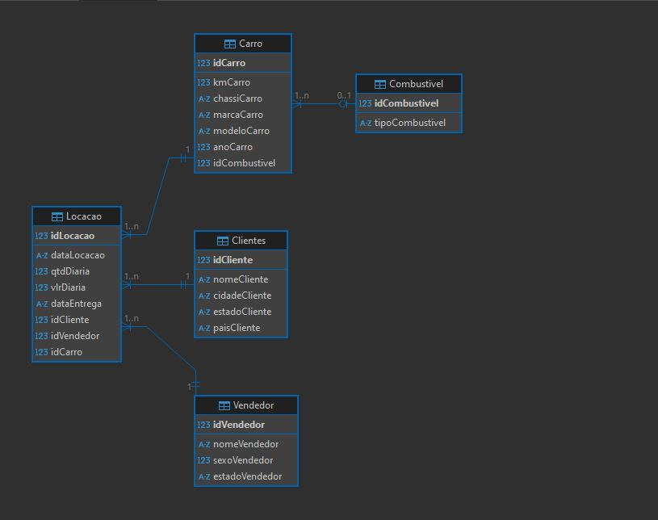
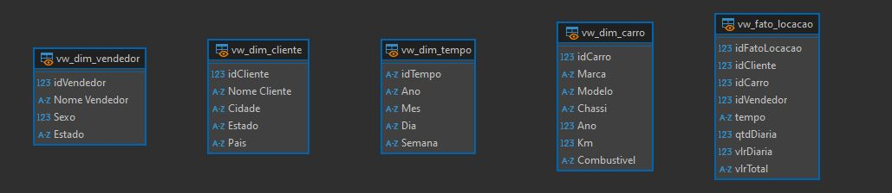

# Desafio 
[Link para o vídeo](https://compasso-my.sharepoint.com/:v:/g/personal/vitor_borges_pb_compasso_com_br/Ec5b5nMiqPdAi6AcSUFWGj4B8BuLgTpAq-qh0vVbE4CB3A?nav=eyJyZWZlcnJhbEluZm8iOnsicmVmZXJyYWxBcHAiOiJTdHJlYW1XZWJBcHAiLCJyZWZlcnJhbFZpZXciOiJTaGFyZURpYWxvZy1MaW5rIiwicmVmZXJyYWxBcHBQbGF0Zm9ybSI6IldlYiIsInJlZmVycmFsTW9kZSI6InZpZXcifX0%3D&e=KMcF1W)
## Etapa 1
Nessa etapa, foi passado uma tabela única com todos os dados agrupados, e sem nenhuma relação que otimizasse o banco de dados.

A partir disso, foi pedido que normalizasse a tabela para organizar os valores com chaves primárias e estrangeiras.

Para a tabela **Clientes** foi criado o seguinte script:
```sql
create table Clientes (
	idCliente int primary key,
	nomeCliente varchar(100) not null,
	cidadeCliente varchar(40) not null,
	estadoCliente varchar(40) not null,
	paisCliente varchar(40) not null
);
```
Observe como os dados estão organizados pelo contexo do cliente.

<br>
<hr>
<br>

Para a tabela **Carro** foi criado o seguinte script:
```sql
create table Carro (
	idCarro int primary key,
	kmCarro int not null,
	chassiCarro varchar(50) not null,
	marcaCarro varchar(80) not null,
	modeloCarro varchar(80) not null,
	anoCarro int not null,
	idCombustivel int,
	foreign key (idCombustivel) references Combustivel(idCombustivel)
);
```
Observe como os dados estão organizados pelo contexo do carro, e também existe uma chave estrangeira *idCombustivel* que referência a tabela **Combustivel** (que será criada posteriormente).

<br>
<hr>
<br>

Para a tabela **Combustivel** foi criado o seguinte script:
```sql
create table Combustivel (
	idCombustivel int primary key,
	tipoCombustivel varchar(20) not null
);
```
Observe como os dados estão organizados no contexto do tipo de combustivel usado pelo carro que o referência.

<br>
<hr>
<br>

Para a tabela **Vendedor** foi criado o seguinte script:
```sql
create table Vendedor (
	idVendedor int primary key,
	nomeVendedor varchar(15) not null,
	sexoVendedor smallint not null,
	estadoVendedor varchar(40) not null
);
```
Observe que os dados estão organizados pelo contexto do vendedor, que se assemelha com a tabela clientes.

<br>
<hr>
<br>

Para a tabela **Locacao** foi criado o seguinte script:
```sql
create table Locacao (
	idLocacao int primary key,
	dataLocacao datetime not null,
	qtdDiaria int not null,
	vlrDiaria decimal(18, 2) not null,
	dataEntega datetime not null,
	horaEntreha datetime not null,
	idCliente int not null,
	idVendedor int not null,
	idCarro int not null,
	foreign key (idCliente) references Clientes(idCliente),
	foreign key (idVendedor) references Vendedor(idVendedor),
	foreign key (idCarro) references Carro(idCarro)
);
```
Observe como a tabela está organizada pelo contexto da locação, aonde se reune todos os dados importantes para aquele serviço.

Tudo isso que escrevi está contido [neste link](./etapa-1/modelo-relacional.sql)

E no fim disso tudo, o diagrama ficou assim:


## Etapa 2
Na etapa 2 do desafio, eu aproveitei o banco de dados já existente e apenas criei as views para representar o banco de dados dimensional.

O Modelo de Dados Dimensional é usado principalmente em Data **Warehouses** e **BI (Business Inteligence)** para otimizar consultas e criar relátorios mais facilmente. 

Os dados são organizados de uma forma que facilita o uso de querys para extrair informações. As estruturas usadas são geralmente **Esquema Estrela (Star Schema)** e **Esquema Floco de Neve (Snowflake Schema)**.

Usarei o **Star Schema** nesse desafio.

Começo criando a **vw_fato_locacao** (Tabela Fato Locação), aonde vai ser armazenados todos os valores mensuráveis que serão ultilizados para criar relatórios e métricas:
```sql
create view vw_fato_locacao as
select distinct l.idLocacao as idFatoLocacao, cl.idCliente, c.idCarro, v.idVendedor, 
cast(strftime('%s', l.dataLocacao) - strftime('%s', l.dataEntrega) as integer) / 86400 as tempo, l.qtdDiaria, l.vlrDiaria, (l.qtdDiaria * l.vlrDiaria) as vlrTotal 
from Locacao l
join Clientes cl on cl.idCliente = l.idCliente
join Carro c on c.idCarro = l.idCarro
join Vendedor v on v.idVendedor = l.idVendedor;
```

<br>
<hr>
<br>

Agora com a tabela fato criada, posso prosseguir para as dimensões que darão contexto aos valores tabelados.

Criando a ***vw_dim_cliente*** (Tabela Dimensão Cliente):
```sql
create view vw_dim_cliente as 
select distinct c.idCLiente, c.nomeCliente as 'Nome Cliente', c.cidadeCliente as Cidade, c.estadoCliente as Estado, c.paisCliente as Pais
from Clientes c;
```

<br>
<hr>
<br>

Criando a **vw_dim_carro** (Tabela Dimensão Carro):
```sql
create view vw_dim_carro as
select distinct c.idCarro, c.marcaCarro as Marca, c.modeloCarro as Modelo, c.chassiCarro as Chassi, 
c.anoCarro as Ano, c.kmCarro as Km, co.tipoCombustivel as Combustivel
from Carro c
join Combustivel co on co.idCombustivel = c.idCombustivel;
```

<br>
<hr>
<br>

Criando a **vw_dim_vendedor** (Tabela Dimensão Vendedor):
```sql
create view vw_dim_vendedor as
select distinct v.idVendedor, v.nomeVendedor as 'Nome Vendedor', v.sexoVendedor as Sexo, v.estadoVendedor as Estado
from Vendedor v;
```

<br>
<hr>
<br>

Criando a **vw_dim_tempo** (Tabela Dimensão Tempo):
```sql
create view vw_dim_tempo as
select distinct l.dataLocacao as idTempo, strftime('%Y', l.dataLocacao) as Ano, strftime('%m', l.dataLocacao) as Mes, 
strftime('%d', l.dataLocacao) as Dia, strftime('%W', l.dataLocacao) as Semana
from Locacao l;
```

Tudo isso que escrevi está contido [neste link](./etapa-2/modelo-dimensional.sql)

E no fim, as tabelas ficaram assim:
