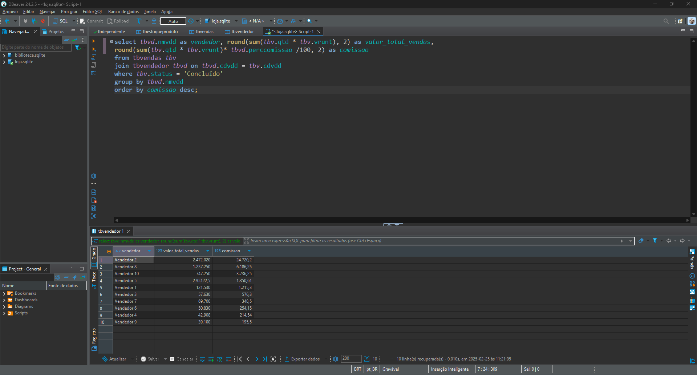

# Sprint 1
## Resumo
**SQL:** a partir dos cursos, eu aprendi a linguagem usada para manipular e fazer querys em bancos de dados relacionais. Aprendi a encadear selects para buscar dados especificos em uma tabela; aprendi a usar joins para agregar dados e otimizar o mecanismo de busca do banco de dados; 

**Markdown:** entendi como funciona a organização de um arquivo ".md" e como manipular seus elementos para criar links, exibir imagens e tabelas.

**Git e Github:** aprendi sobre o ambiente de repositórios github e a como manipular sua estrutura a partir de comandos git no terminal. Além disso, entendi como funciona o repósitorio local e virtual usando funções add, commit, reset, push e pull.

**Modelo Relacional:** o modelo relacional funciona a partir de chaves primárias e estrangeiras que se relacionam para formar banco de dados complexos e bem estruturados.

**Modelo Dimensional:** o modelo dimensional é usado principalmente em Data Warehouses e BI (Business Intelligence) para otimizar consultas e extrair dados de forma mais eficiente. A organização dos dados é construida em fatos e dimensões, onde a tabela fato possui dados mensuráveis e as tabelas dimensões contém atributos descritivos que darão contexto a tabela fato.

## Desafio
[Link para o desafio](./Desafio/README.md)

## Exercícios

    
Exercicio 1

        <a href="./Exercicios/exercicio1.sql">Resposta</a>
        

 

    
Exercício 2

        <a href="./Exercicios/exercicio2.sql">Resposta</a>
        

 

    
Exercício 3

        <a href="./Exercicios/exercicio3.sql">Resposta</a>
        

 

    
Exercício 4

        <a href="./Exercicios/exercicio4.sql">Resposta</a>
         
        

 

    
Exercício 5

        <a href="./Exercicios/exercicio5.sql">Resposta</a>
        

 

    
Exercício 6

        <a href="./Exercicios/exercicio6.sql">Resposta</a>
        

 

    
Exercício 7

        <a href="./Exercicios/exercicio7.sql">Resposta</a>
         
        
A query seleciona o autor

        

 

    
Exercício 8

        <a href="./Exercicios/exercicio8.sql">Resposta</a>
        

 

    
Exercício 9

        <a href="./Exercicios/exercicio9.sql">Resposta</a>
        

 

    
Exercício 10

        <a href="./Exercicios/exercicio10.sql">Resposta</a>
        

 

    
Exercício 11

        <a href="./Exercicios/exercicio11.sql">Resposta</a>
        

 

    
Exercício 12

        <a href="./Exercicios/exercicio12.sql">Resposta</a>
        

 

    
Exercício 13

        <a href="./Exercicios/exercicio13.sql">Resposta</a>
        

 

    
Exercício 14

        <a href="./Exercicios/exercicio14.sql">Resposta</a>
        

 

    
Exercício 15

        <a href="./Exercicios/exercicio15.sql">Resposta</a>
        

 

    
Exercício 16

        <a href="./Exercicios/exercicio16.sql">Resposta</a>
        

 

    
Exercício Seção 6 Etapa 1

        <a href="./Exercicios/exercicio-secao6-etapa1.csv">Resposta</a>
        

 

    
Exercício Seção 6 Etapa 2

        <a href="./Exercicios/exercicio-secao6-etapa2.csv">Resposta</a>
        

