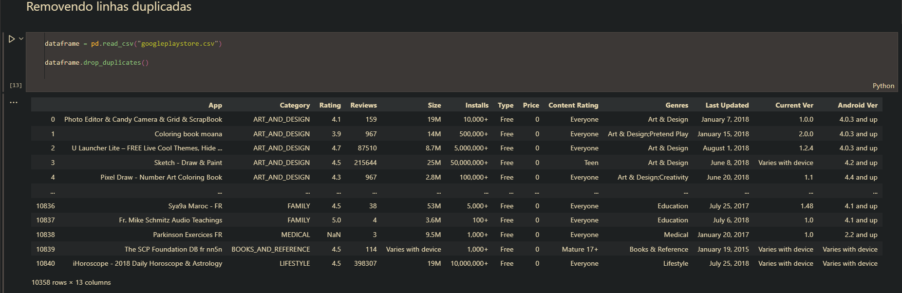
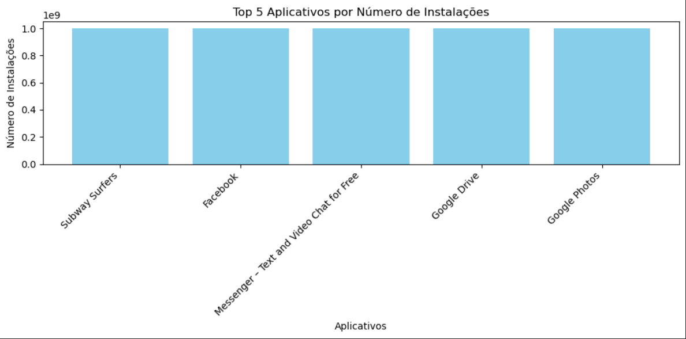
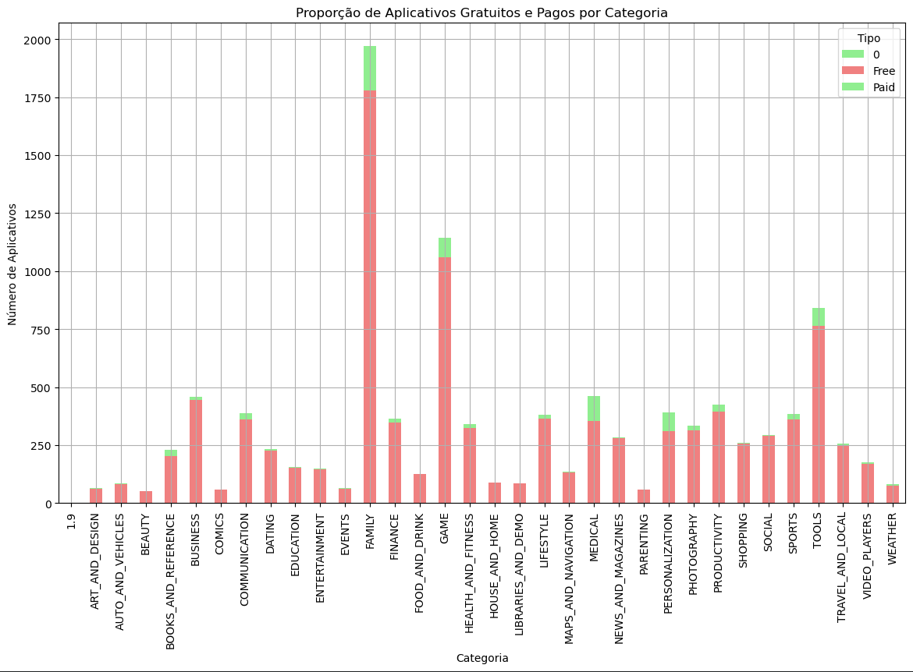
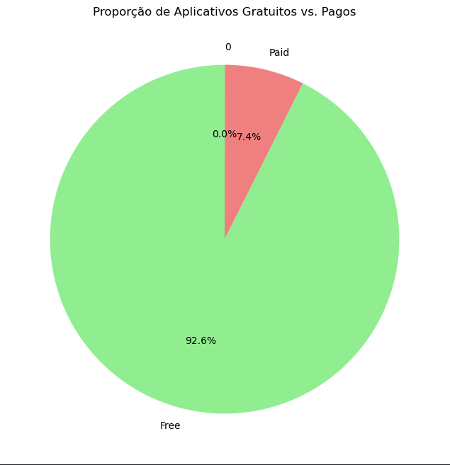

# Desafio 
[Link para o vídeo](https://compasso-my.sharepoint.com/:v:/r/personal/vitor_borges_pb_compasso_com_br/Documents/vitor.borges-sprint02.mkv?csf=1&web=1&e=Zepd9z&nav=eyJyZWZlcnJhbEluZm8iOnsicmVmZXJyYWxBcHAiOiJTdHJlYW1XZWJBcHAiLCJyZWZlcnJhbFZpZXciOiJTaGFyZURpYWxvZy1MaW5rIiwicmVmZXJyYWxBcHBQbGF0Zm9ybSI6IldlYiIsInJlZmVycmFsTW9kZSI6InZpZXcifX0%3D)

## Etapa 1
Iniciei importando as bibliotecas que eu iria usar.

```python
!conda install --yes pandas matplotlib
import pandas as pd
import matplotlib.pyplot as plt
```

A partir disso, tratei os dados duplicados com a função *drop_duplicate()*
```python
dataframe = pd.read_csv("googleplaystore.csv")

dataframe.drop_duplicates()
```

Agora com os dados sem duplicações, eu comecei a modificar o dataframe para criar o gráfico do top 5 apps mais baixados, retirando simbolos e convertendo os dados para numérico.
```python
dataframe["Installs"] = dataframe["Installs"].str.replace("+", "", regex=False)
dataframe["Installs"] = dataframe["Installs"].str.replace(",", "", regex=False)
dataframe["Installs"] = pd.to_numeric(dataframe["Installs"], errors="coerce")

dataframe_sorted = dataframe.sort_values(by="Installs",ascending=False)

top_5_apps = dataframe_sorted.head(6)
```



Depois, com os dados filtrados, eu criei o gráfico em barras do top 5 apps mais baixados.
```python
plt.figure(figsize=(10,5))
plt.bar(top_5_apps["App"], top_5_apps["Installs"], color="skyblue")
plt.xlabel('Aplicativos')
plt.ylabel('Número de Instalações')
plt.title('Top 5 Aplicativos por Número de Instalações')
plt.xticks(rotation=45, ha='right')

plt.tight_layout()

plt.show()
```



<br>
<hr>
<br>

Para criar o gráfico em pizza, eu utilizei a função *value_counts()* para mostrar as categorias existentes e extrair o top 10.
```python
category_count = dataframe["Category"].value_counts()

top_category = category_count.head(10)
```

Com esses dados, eu criei o gráfico em pizza do Top 10 Categorias Mais Comuns no Google Playstore.
categorias existentes e extrair o top 10.
```python
plt.figure(figsize=(8, 8))
plt.pie(top_category, labels=top_category.index, autopct='%1.1f%%')
plt.title(f"Top 10 Categorias Mais Comuns no Google Playstore")
plt.axis("equal")
plt.show()
```


<br>
<hr>
<br>

Para mostrar o app mais caro no dataframe, removi os sifrões da coluna "Price" e converti-os para o valor numérico.
```python
dataframe["Price"] = dataframe["Price"].str.replace("$", "", regex=False)
dataframe["Price"] = pd.to_numeric(dataframe["Price"], errors="coerce")
```
 Após isso, eu peguei o valor máximo da coluna "Price" utilizando a função *idmax()*.
```python
most_expensive_app = dataframe.loc[dataframe["Price"].idxmax()]

print("O app mais caro é ")
print(most_expensive_app[["App", "Category", "Price"]])
```

<br>
<hr>
<br>

Para filtrar os apps com classificação "Mature 17+", eu utilizei uma função de subset para localizar os valores com "Mature 17+" e depois, usando a função *shape*, mostrar a quantidade de linhas que satisfazem a função anterior.
```python
mature_apps = dataframe[dataframe["Content Rating"] == "Mature 17+"].shape[0]

print(f"Total de aplicativos com Content Rating 'Mature 17+': {mature_apps}")
```

<br>
<hr>
<br>

Para mostrar o rop 10 apps por número de review, eu comecei transformando os dados da coluna "Review" em numéricos.
```python
dataframe["Reviews"] = pd.to_numeric(dataframe["Reviews"], errors="coerce")
```

E depois utilizei a função *sort_values* para ordenar os valores de forma decrescente e utilizando um slice, extrair as primeiras 10 linhas.
```python
top_10_per_review = dataframe.sort_values("Reviews", ascending=False)[:10]
print("Top 10 apps por número de reviews: ")
print(top_10_per_review[["App", "Category", "Reviews"]])
```

<br>
<hr>
<br>

Criei também duas operações: um para contar os apps pagos e grátis, e outro para agrupar categorias e pagos ou grátis.
 ```python
dataframe = dataframe.dropna(subset=['Type'])
type_counts = dataframe['Type'].value_counts()

category_type_counts = dataframe.groupby(['Category', 'Type']).size().unstack(fill_value=0)
category_count = category_count.fillna(0)
```

Posteriormente criei dois gráficos. Um de Proporção de Aplicativos Gratuitos e Pagos por Categoria, e a Proporção de Aplicativos Gratuitos vs. Pagos.
 ```python
plt.figure(figsize=(14, 8))
category_type_counts.plot(kind='bar', stacked=True, color=['lightgreen', 'lightcoral'], figsize=(14, 8))
plt.title('Proporção de Aplicativos Gratuitos e Pagos por Categoria')
plt.xlabel('Categoria')
plt.ylabel('Número de Aplicativos')
plt.xticks(rotation=90)
plt.legend(title='Tipo')
plt.grid(True)
plt.show()
```

 ```python
plt.figure(figsize=(8, 8))
plt.pie(type_counts, labels=type_counts.index, autopct='%1.1f%%', colors=['lightgreen', 'lightcoral'], startangle=90)
plt.title('Proporção de Aplicativos Gratuitos vs. Pagos')
plt.show()
```


<br>
<hr>
<br>

Tudo isso que escrevi está contido [neste link](./desafio.ipynb)