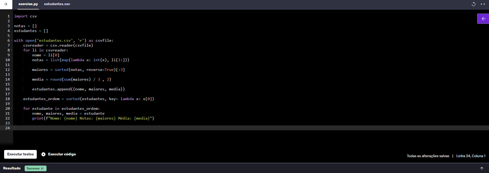

# Sprint 2
## Resumo
**Python:** a partir dos cursos, eu aprendi a linguagem de script python, usada para criar e manipular código que será usado em análise de dados. Entendi o conceito de programação orientada a objetos, programação funcional e demais funções de estatística.

**Biblioteca Pandas:** aprendi a usar a biblioteca pandas para manipular dataframes com milhares de linhas.

**Biblioteca Matplotlib:** aprendi a usar a bibilioteca matplotlib para criar gráficos dos mais variádos tipos a partir de dataframes previamente tratados.

## Desafio
[Link para o desafio](./Desafio/README.md)

## Exercícios

    
Exercicio 1

        <a href="./Exercicios/exercicio-01.py">Resposta</a>
        

 

    
Exercicio 2

        <a href="./Exercicios/exercicio-02.py">Resposta</a>
        

 

    
Exercicio 3

        <a href="./Exercicios/exercicio-03.py">Resposta</a>
        

 

    
Exercicio 4

        <a href="./Exercicios/exercicio-04.py">Resposta</a>
        

 

    
Exercicio 5

        <a href="./Exercicios/exercicio-05.py">Resposta</a>
        

 

    
Exercicio 6

        <a href="./Exercicios/exercicio-06.py">Resposta</a>
        

 

    
Exercicio 7

        <a href="./Exercicios/exercicio-07.py">Resposta</a>
        

 

    
Exercicio 8

        <a href="./Exercicios/exercicio-08.py">Resposta</a>
        

 

    
Exercicio 9

        <a href="./Exercicios/exercicio-01.py">Resposta</a>
        

 

    
Exercicio 10

        <a href="./Exercicios/exercicio-01.py">Resposta</a>
        

 

    
Exercicio 11

        <a href="./Exercicios/exercicio-11.py">Resposta</a>
        

 

    
Exercicio 12

        <a href="./Exercicios/exercicio-12.py">Resposta</a>
        

 

    
Exercicio 13

        <a href="./Exercicios/exercicio-13.py">Resposta</a>
        

 

    
Exercicio 14

        <a href="./Exercicios/exercicio-14.py">Resposta</a>
        

 

    
Exercicio 15

        <a href="./Exercicios/exercicio-15.py">Resposta</a>
        

 

    
Exercicio 16

        <a href="./Exercicios/exercicio-16.py">Resposta</a>
        

 

    
Exercicio 17

        <a href="./Exercicios/exercicio-17.py">Resposta</a>
        

 

    
Exercicio 18

        <a href="./Exercicios/exercicio-18.py">Resposta</a>
        

 

    
Exercicio 19

        <a href="./Exercicios/exercicio-19.py">Resposta</a>
        

 

    
Exercicio 20

        <a href="./Exercicios/exercicio-20.py">Resposta</a>
        

 

    
Exercicio 21

        <a href="./Exercicios/exercicio-21.py">Resposta</a>
        

 

    
Exercicio 22

        <a href="./Exercicios/exercicio-22.py">Resposta</a>
        

 

    
Exercicio 23

        <a href="./Exercicios/exercicio-23.py">Resposta</a>
        

 

    
Exercicio 24

        <a href="./Exercicios/exercicio-24.py">Resposta</a>
        

 

    
Exercicio 25

        <a href="./Exercicios/exercicio-25.py">Resposta</a>
        

 

    
Exercicio 26

        <a href="./Exercicios/exercicio-26.py">Resposta</a>
        

 

    
Exercicio ETL 1

        <a href="./Exercicios/ETL/exercicio-etl-etapa1.py">Resposta</a> | <a href="./Exercicios/ETL/etapa-1.txt">Output</a>
        

 

    
Exercicio ETL 2

        <a href="./Exercicios/ETL/exercicio-etl-etapa2.py">Resposta</a> | <a href="./Exercicios/ETL/etapa-2.txt">Output</a>
        

 

    
Exercicio ETL 3

        <a href="./Exercicios/ETL/exercicio-etl-etapa3.py">Resposta</a> | <a href="./Exercicios/ETL/etapa-3.txt">Output</a>
        

 

    
Exercicio ETL 4

        <a href="./Exercicios/ETL/exercicio-etl-etapa4.py">Resposta</a> | <a href="./Exercicios/ETL/etapa-4.txt">Output</a>
        

 

    
Exercicio ETL 5

        <a href="./Exercicios/ETL/exercicio-etl-etapa5.py">Resposta</a> | <a href="./Exercicios/ETL/etapa-5.txt">Output</a>
        

 
