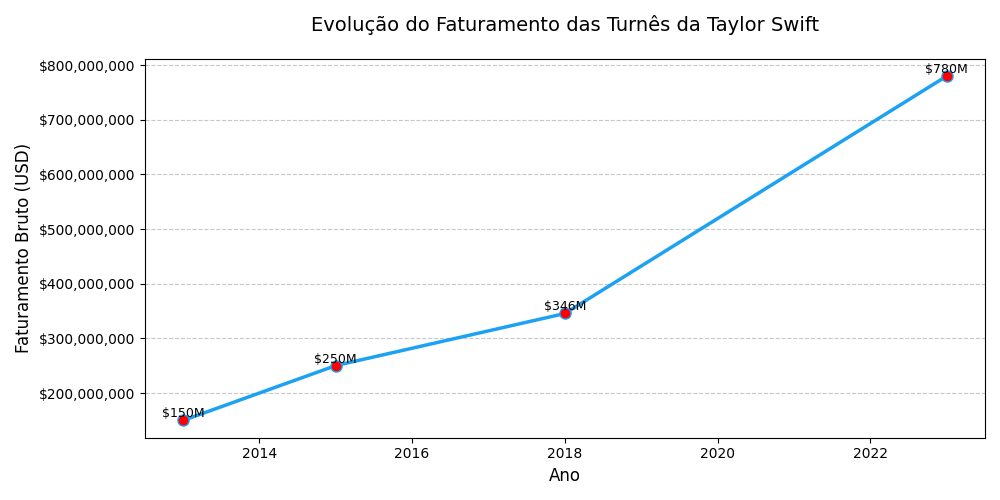
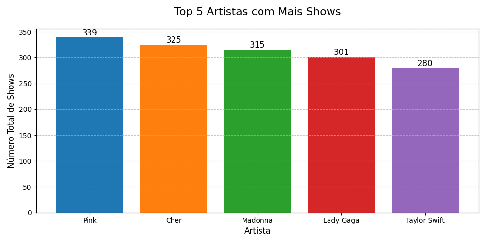
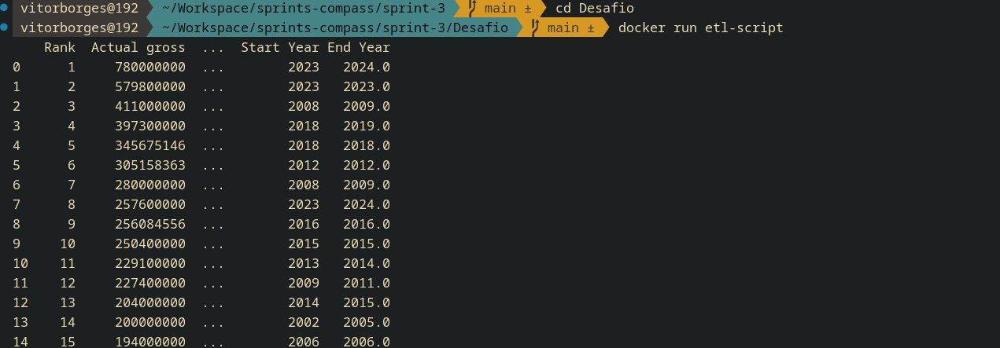
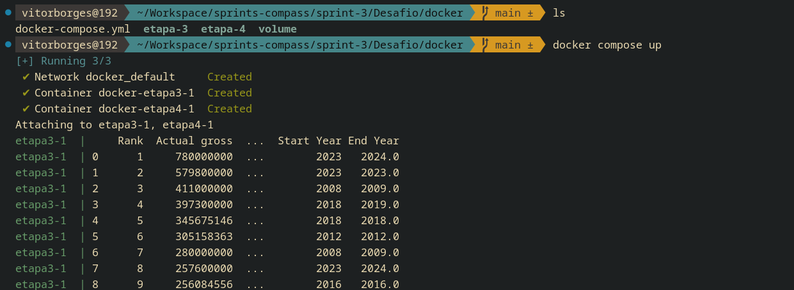

# Desafio
[Link para o vídeo](https://compasso-my.sharepoint.com/:v:/r/personal/vitor_borges_pb_compasso_com_br/Documents/vitor.borges-sprint03.mkv?csf=1&web=1&e=f2URTV)

## Etapa 1
Iniciei importando a biblioteca *pandas* para tratar os dados da tabela csv que foi disponibilizada.

```python
import pandas as pd
```

Após isso, removi qualquer possível valor duplicado e exclui algumas colunas que não são relevantes para o nosso trabalho.

```python
df = pd.read_csv('concert_tours_by_women.csv')

df.drop_duplicates()
df.drop(['Ref.', 'Peak', 'All Time Peak'], axis=1, inplace=True)
```

Com a coluna **Year(s)**, eu criei **Start Year** e **End Year** para facilitar as opereções.

```python
df[['Start Year', 'End Year']] = df['Year(s)'].str.extract(r'(\d{4})-?(\d{4})?')
df['Start Year'] = pd.to_numeric(df['Start Year'])
df['End Year'] = pd.to_numeric(df['End Year'])
df['End Year'] = df['End Year'].fillna(df['Start Year'])

df.drop(['Year(s)'], axis=1, inplace=True)
```

Converti algumas colunas para o valor numérico e retirei quaisquer símbolos que poderiam gerar erros no nosso código.

```python
df['Actual gross'] = df['Actual gross'].str.replace('$', '', regex=False)
df['Actual gross'] = df['Actual gross'].str.replace(',', '', regex=False)
df['Actual gross'] = df['Actual gross'].str.replace(r'\[.*\]', '', regex=True)
df['Actual gross']= pd.to_numeric(df['Actual gross'], errors='coerce')

df['Average gross'] = df['Average gross'].str.replace('$', '', regex=False)
df['Average gross'] = df['Average gross'].str.replace(',', '', regex=False)
df['Average gross'] = df['Average gross'].str.replace(r'\[.*\]', '', regex=True)
df['Average gross']= pd.to_numeric(df['Average gross'], errors='coerce')

df['Adjustedgross (in 2022 dollars)'] = df['Adjustedgross (in 2022 dollars)'].str.replace('$', '', regex=False)
df['Adjustedgross (in 2022 dollars)'] = df['Adjustedgross (in 2022 dollars)'].str.replace(',', '', regex=False)
df['Adjustedgross (in 2022 dollars)'] = df['Adjustedgross (in 2022 dollars)'].str.replace(r'\[.*\]', '', regex=True)
df['Adjustedgross (in 2022 dollars)']= pd.to_numeric(df['Adjustedgross (in 2022 dollars)'], errors='coerce')

df['Tour title'] = df['Tour title'].str.replace(r'(?<=Tour).*', '', regex=True)
df['Tour title'] = df['Tour title'].str.replace('†', '', regex=False)

df['Shows'] = pd.to_numeric(df['Shows'], errors='coerce')
```

Depois de todos os dados serem devidamente tratados e estarem compatíveis com o modelo exigido, eu exportei essa planilha para csv com o nome de **csv_limpo.csv**.

```python 
df.to_csv('output/csv_limpo.csv', index=False)
```

## Etapa 2

Na etapa 2 eu utilizei os dados já tratados no script anterior.

Na questão 1 eu mostrei o artista que mais aparece e que possui maior média em faturamento bruto. Utilizei também a função dataframe para tabular a saída de dados.

```python
appear_most_and_most_total_gross = df.loc[(df['Artist'].value_counts().max()) & (df['Actual gross'].max())]

q1 = pd.DataFrame({
    "Métrica": ["Artista mais frequente", "Maior Bilheteria"],
    "Valor": [appear_most_and_most_total_gross['Artist'], appear_most_and_most_total_gross['Actual gross']]
})
```

<br>
<hr>
<br>

Na questão 2 eu apresentei a turnê com a maior média de faturamento bruto.

```python
single_year_turne = df.loc[(df['Start Year'] == df['End Year'])]

max_average_gross_tour_by_year = single_year_turne.loc[single_year_turne['Average gross'].idxmax()]

q2 = pd.DataFrame({
    "Métrica": ["Artista", "Nome do Tour", "Lucro Médio"],
    "Valores": [max_average_gross_tour_by_year['Artist'], max_average_gross_tour_by_year['Tour title'], max_average_gross_tour_by_year['Average gross']]
})
```

<br>
<hr>
<br>

Na questão 3 foi feito um top 3 artistas que possuem o show (unitário) mais lucrativo.

```python
df['Adjusted average per show'] = df['Adjustedgross (in 2022 dollars)'] / df['Shows']

top_3_most_profitable_per_show = df.sort_values('Adjusted average per show', ascending=False).head(3)

q3 = top_3_most_profitable_per_show[['Artist', 'Tour title', 'Start Year', 'Adjusted average per show']]
```

A partir dessas 3 questões já respondidas, criei um arquivo **respostas.txt** e armazenei a saída de dado destas operações.

```python
with open('output/respostas.txt', 'w') as file:
    file.writelines(f'Q1:\n\n{q1.to_string(index=False)}\n\nQ2:\n\n{q2.to_string(index=False)}\n\nQ3:\n\n{q3.to_string(index=False)}')
```

<br>
<hr>
<br>

Na questão 4 eu fiz o primeiro gráfico que foi pedido. Um gráfico que mostra o faturamento por ano da turnê da artista que mais aparece na tabela.

Como exigido, o plot usado foi o de linha, que mostra de forma ascendente a performance da artista.

Após isso, utilizei a função *savefig()* para salvar o gráfico como png.

```python
taylor_swift = df.loc[df['Artist'] == 'Taylor Swift'].copy()

yearly_gross = taylor_swift.groupby('Start Year')['Actual gross'].sum().reset_index()

plt.figure(figsize=(10,5))
plt.plot(yearly_gross['Start Year'], yearly_gross['Actual gross'], marker='o', color='#1DA1F2', linewidth=2.5, markersize=8, markerfacecolor='red')
plt.title('Evolução do Faturamento das Turnês da Taylor Swift', fontsize=14, pad=20)
plt.xlabel('Ano', fontsize=12)
plt.ylabel('Faturamento Bruto (USD)', fontsize=12)
plt.grid(axis='y', linestyle='--', alpha=0.7)

plt.gca().yaxis.set_major_formatter('${x:,.0f}')

for x,y in zip(yearly_gross['Start Year'], yearly_gross['Actual gross']):
    plt.text(x, y, f'${y/1e6:.0f}M', ha='center', va='bottom', fontsize=9)

plt.tight_layout()
plt.savefig('output/Q4.png')
plt.show()
plt.close()
```



<br>
<hr>
<br>

Na questão 5 eu criei um gráfico em barras do top 5 artistas com mais shows, e apresentei-os lado a lado.

```python
top_5_artists_with_most_shows = df.groupby('Artist')['Shows'].sum().sort_values(ascending=False).head(5)

plt.figure(figsize=(10,5))
bars = plt.bar(top_5_artists_with_most_shows.index, top_5_artists_with_most_shows.values, color=['#1f77b4', '#ff7f0e', '#2ca02c', '#d62728', '#9467bd'])

plt.title('Top 5 Artistas com Mais Shows', fontsize=16, pad=20)
plt.xlabel('Artista', fontsize=12)
plt.ylabel('Número Total de Shows', fontsize=12)
plt.xticks(fontsize=10)

for bar in bars:
    height = bar.get_height()
    plt.text(bar.get_x() + bar.get_width()/2., height,
             f'{int(height)}', ha='center', va='bottom', fontsize=12)

plt.grid(axis='y', linestyle='--', alpha=0.7)

plt.tight_layout()
plt.savefig('output/Q5.png')
plt.show()
plt.close()

```


## Etapa 3

Nessa etapa 3, eu criei um dockerfile que cria uma imagem **python:3.9-slim** e executa o script da etapa 1.

```dockerfile
FROM python:3.9-slim

WORKDIR /app

COPY . /app

RUN pip install --no-cache-dir -r requeriments.txt

CMD [ "python3", "etl.py" ]
```

Esse dockefile file executa um pip install que lê um arquivo txt aonde estão armazenados as dependências do script.

E como saída, é criado o csv_limpo.csv.



## Etapa 4

Nessa etapa 4, também é criado um dockerfile, só que agora para executar o script da etapa 2.

O dockerfile segue o mesmo modelo da etapa 3, variando apenas nos argumentos do CMD.

```dockerfile
FROM python:3.9-slim

WORKDIR /app

COPY . /app

RUN pip install --no-cache-dir -r requeriments.txt

CMD [ "python3", "job.py" ]
```

## Etapa 5

Agora, na parte mais importantes, iremos usar o docker compose para orquestrar a execução dos nossos containers, criando conexões entre os dois e utilizando o output de um como o input de outro.

```yaml
services:
  etapa3:
    build: ./etapa-3
    volumes: 
      - ./volume/input:/app/output
    environment:
      - OUTPUT_DIR=/app/output

  etapa4:
    build: ./etapa-4
    volumes:
      - ./volume/input:/app/input
      - ./volume/output:/app/output
    depends_on:
      - etapa3
    environment:
      - INPUT_DIR=/app/input
      - OUTPUT_DIR=/app/output
```

O script acima divide a execução dos dois containers.

Note que existem diretorios sendo criados para receber os dados que serão consumidos e retornados pelos códigos python.

Esses diretórios serão armazenados no diretório **volume**.

O dockerfile da etapa 3 será o primeiro a ser buildado e executado. Após  isso, o seu output será direcionado para a pasta compartilhada **"/volume/input"**.

O dockerfile da etapa 4 só será executado quando a etapa 3 tiver terminado. Isso se deve a instrução **depends_on** que espera o container terminar de subir.

Após isso, o script **job.py** irá consumir o arquivo **csv_limpo.csv** que foi tratado e armazenado no diretório **"volume/input"**.

Depois de consumido, o script irá retornar um arquivo **respostas.txt** e duas imagens **png** contendo os gráficos criados com o matplotlib, aonde serão armazenados no diretório **"volume/output"**.

