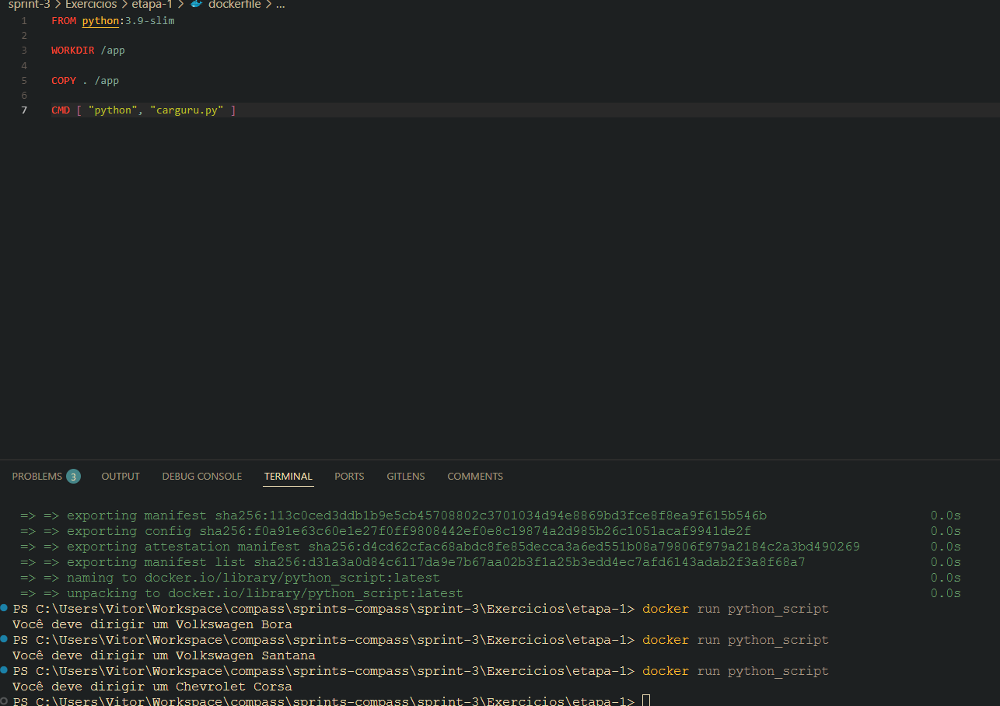
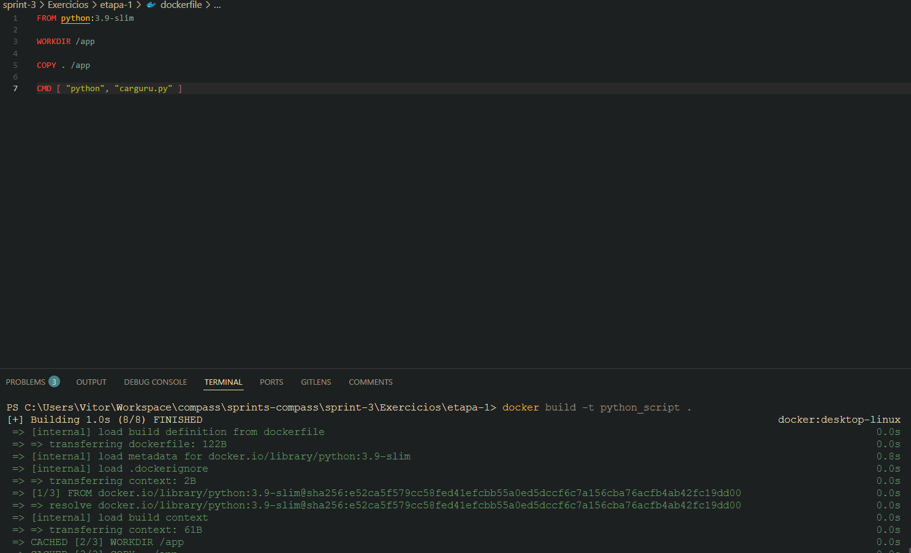
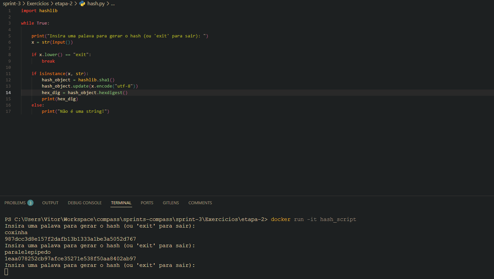
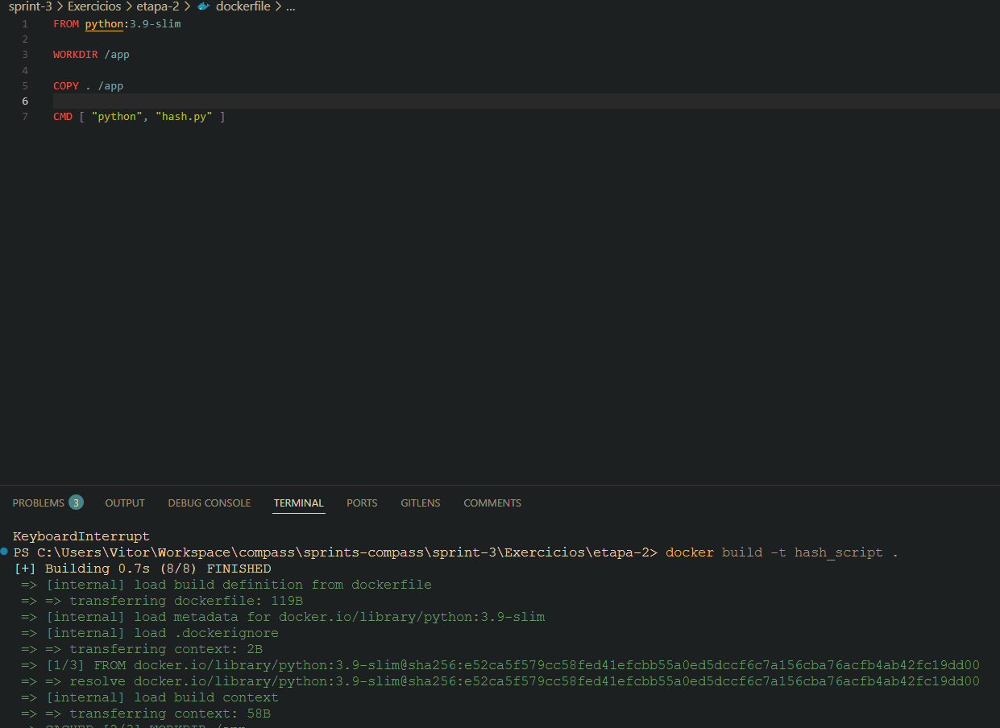

# Sprint 3
## Resumo
**Docker:** aprendi sobre containerização, que é uma tecnologia usada para compactar, distribuir e executar soluções de forma isolada. Executei códigos de criação e execução no dockerfile e docker-compose. 

**AWS Technical Essentials:** nesse curso eu aprendi sobre o ambiente aws, fundamentos de computação na aws, armazenamento e banco de dados, rede e segurança, monitoramente e automação, e fui introduzido a outras soluções AWS.

**AWS Partner: Accreditation (Technical):** neste curso fui introduzido aos fundamentos de aws, principais serviços aws, melhores práticas e arquitetura, casos de uso e soluções para clientes.

## Desafio
[Link para o desafio](./Desafio/README.md)

## Exercicios
### Etapa 1
[Script Python](./Exercicios/etapa-1/carguru.py) | [Dockerfile](./Exercicios/etapa-1/dockerfile)

 

 

### Etapa 2
[Script Python](./Exercicios/etapa-2/hash.py) | [Dockerfile](./Exercicios/etapa-2/dockerfile)

