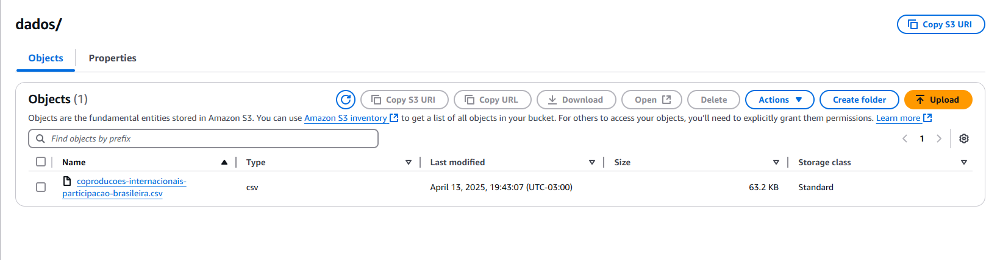
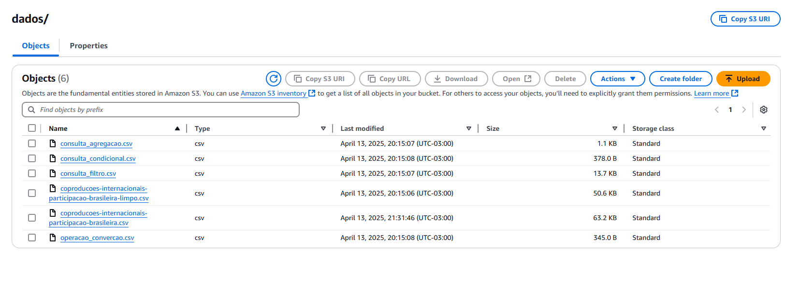

# Desafio
[Link para o vídeo](https://compasso-my.sharepoint.com/:v:/r/personal/vitor_borges_pb_compasso_com_br/Documents/vitor.borges-sprint04.mkv?csf=1&web=1&e=467JPF)

## Etapa 1: Instalando Dependências
Na primeira etapa, foram instaladas as bibliotecas necessárias para o projeto:

**pandas:** Para manipulação e análise de dados.
**boto3:** Para interagir com o serviço S3 da AWS.
**python-dotenv:** Para carregar variáveis de ambiente de um arquivo .env.
**datetime:** Para manipulação de datas.

## Etapa 2: Carregando os Dados
Os dados foram carregados diretamente de um bucket S3. Para isso:

```python
response = s3.get_object(Bucket=bucket, Key=DESTINO_S3)
file_content = response['Body'].read().decode('utf-8')
df = pd.read_csv(StringIO(file_content), sep=';')
```

Foi configurado o cliente S3 utilizando as credenciais armazenadas no arquivo .env.
O arquivo CSV foi baixado do bucket e carregado em um DataFrame pandas.

## Etapa 3: Limpando os Dados
Os dados passaram por um processo de limpeza para garantir sua consistência:

1. Remoção de valores nulos e duplicados.
2. Padronização dos nomes das colunas: Convertidos para letras minúsculas e substituídos espaços por underscores.
3. Remoção de aspas extras nas duas primeiras linhas.
4. Renomeação de colunas: Por exemplo, titulo_original foi renomeado para titulo, e data_emissao_cpb para data.

O DataFrame limpo foi salvo em um arquivo chamado **coproducoes-internacionais-participacao-brasileira.csv**.



## Etapa 4: Consultas e Operações
4.1 Consulta 1: Produções Majoritárias Após 2015
Foi realizada uma consulta para filtrar produções majoritárias emitidas após 2015. A consulta utilizou dois operadores lógicos:

* A coluna **part_patrimonial_brasileira** foi filtrada para valores iguais a "MAJORITÁRIA".
* A coluna data foi convertida para o formato datetime e filtrada para datas posteriores a 01/01/2015.
  
O resultado foi salvo no arquivo **consulta_filtro.cs**.

<br>
<hr>
<br>

4.2 Consulta 2: Contagem de Produções por Tipo de Acordo

Agrupamos os dados pela coluna acordo_coproducao e contamos o número de produções para cada tipo de acordo. O resultado foi ordenado em ordem decrescente e limitado aos 10 principais tipos de acordo.

O resultado foi salvo no arquivo consulta_agregacao.csv.

<br>
<hr>
<br>

4.3 Operação 1: Categorização de Filmes

Criamos uma nova coluna chamada **categoria**, que classifica os filmes como "Recente" (após 2015) ou "Antigo" (2015 ou antes). A categorização foi feita com base no ano da coluna **data**.

O resultado foi salvo no arquivo **consulta_condicional.csv**.

<br>
<hr>
<br>

4.4 Operação 2: Conversão de Datas

A coluna **data** foi convertida para o formato datetime, e uma nova coluna ano foi criada para armazenar apenas o ano de emissão.

O resultado foi salvo no arquivo **operacao_convercao.csv**.

<br>
<hr>
<br>

4.5 Operação 3: Adição do Mês de Emissão

Adicionamos uma nova coluna chamada **mes_emissao**, que contém o mês de emissão em formato textual (ex.: "Janeiro").

<br>
<hr>
<br>

4.6 Operação 4: Formatação de Títulos

Criamos uma nova coluna chamada **titulo_formatado**, que contém os títulos em letras minúsculas e sem espaços extras.

O resultado foi salvo no arquivo **operacao_string.csv**.

## Etapa 5: Upload dos Arquivos para o Bucket S3
Todos os arquivos gerados foram enviados para o bucket S3. A função upload_to_s3 foi utilizada para realizar o upload:

```python
def upload_to_s3(file_name, bucket, s3_key):
    try:
        s3.upload_file(file_name, bucket, s3_key)
        print(f"Arquivo {file_name} enviado para {s3_key} com sucesso!")
    except Exception as e:
        print(f"Erro ao enviar {file_name} para o bucket: {e}")
```

Os arquivos enviados foram:

* coproducoes-internacionais-participacao-brasileira-limpo.csv
* sconsulta_filtro.csv
* consulta_agregacao.csv
* consulta_condicional.csv
* operacao_convercao.csv
* operacao_string.csv
  

