# Sprint 4
## Resumo
**AWS Cloud Economics:** O curso de AWS Cloud Economics basicamente ensina como entender os custos e benefícios de usar a nuvem da AWS, comparando com a infraestrutura tradicional (tipo servidores físicos que ficam na empresa).

A ideia principal é que a nuvem não é só mais prática, mas também pode ser mais barata e eficiente — se for usada do jeito certo.

**AWS Sales Accreditation:** O AWS Sales Accreditation (Foundational) é um curso voltado para quem está começando a trabalhar com vendas ou pré-vendas de soluções em nuvem da AWS. O foco é mais comercial do que técnico, e o objetivo é preparar a pessoa para conversar com clientes, entender as necessidades deles e oferecer soluções da AWS de forma clara e convincente.

**AWS Cloud Quest:** O AWS Cloud Quest é um curso diferente dos outros porque é feito no formato de um jogo 3D interativo, onde você assume o papel de um personagem que precisa ajudar uma cidade a resolver problemas com soluções baseadas em nuvem. Em vez de só assistir aulas e ler materiais, você vai resolvendo desafios práticos, o que torna o aprendizado mais dinâmico e até divertido.

A proposta do curso é ensinar os fundamentos da AWS de forma prática. Enquanto você vai avançando no jogo, aprende sobre conceitos como computação em nuvem, redes, armazenamento, banco de dados, segurança, automação e outras soluções da AWS. Cada vez que completa uma missão, desbloqueia novos conhecimentos e ganha experiência. Isso ajuda bastante a fixar o conteúdo, porque você aplica o que acabou de aprender em um cenário simulado.

## Desafio
[Link para o desafio](./Desafio/README.md)

## Exercicios
### Athena
Neste exercício, eu usei a ferramenta Athena para fazer queries em um dataset fornecido.

Nessa primeira parte eu criei a tabela onde seria armazenado os dados importados de um csv.

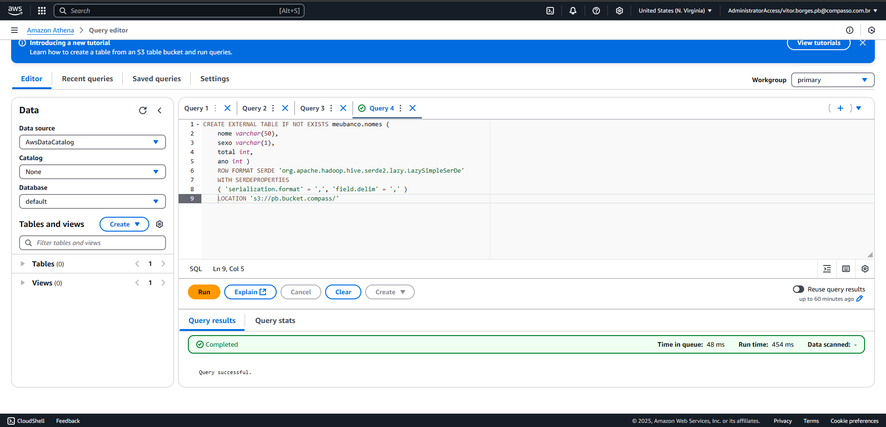

Criei a query para criar uma lista dos 3 nomes mais usados em cada década desde o 1950 até hoje.

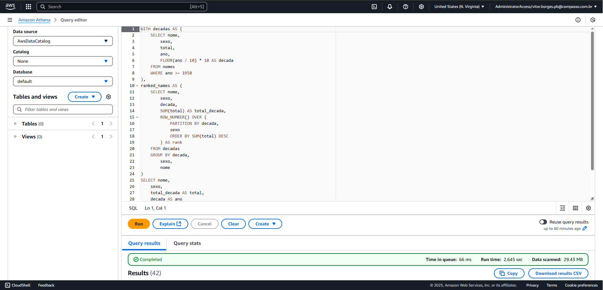

E depois mostrei o resultado.

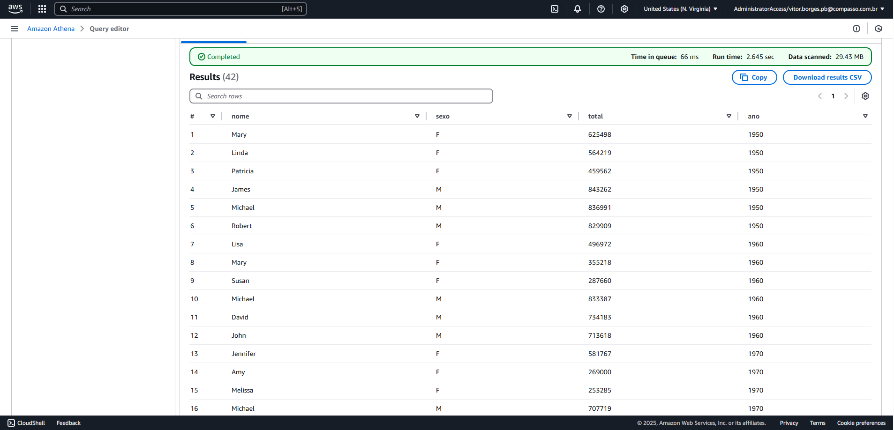

 

 

### Lambda

Criei o script python que seria executado na função lambda.

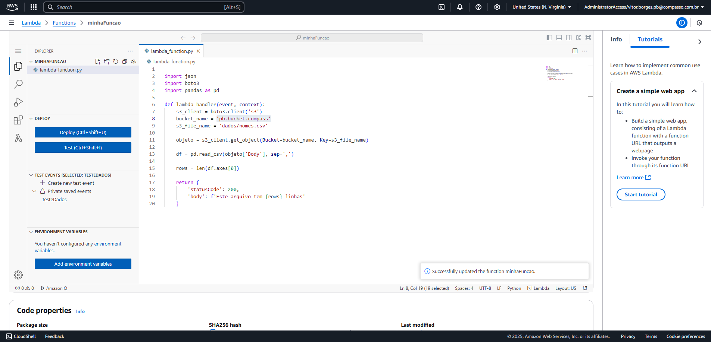

Criei a layer do lambda.

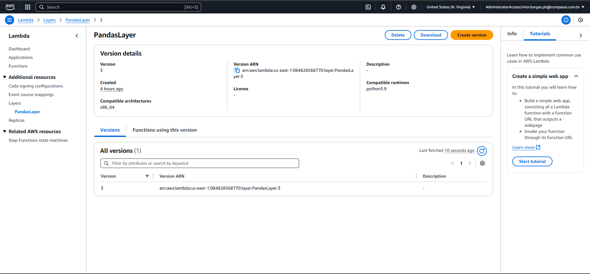

Subi o container para usar no layer.

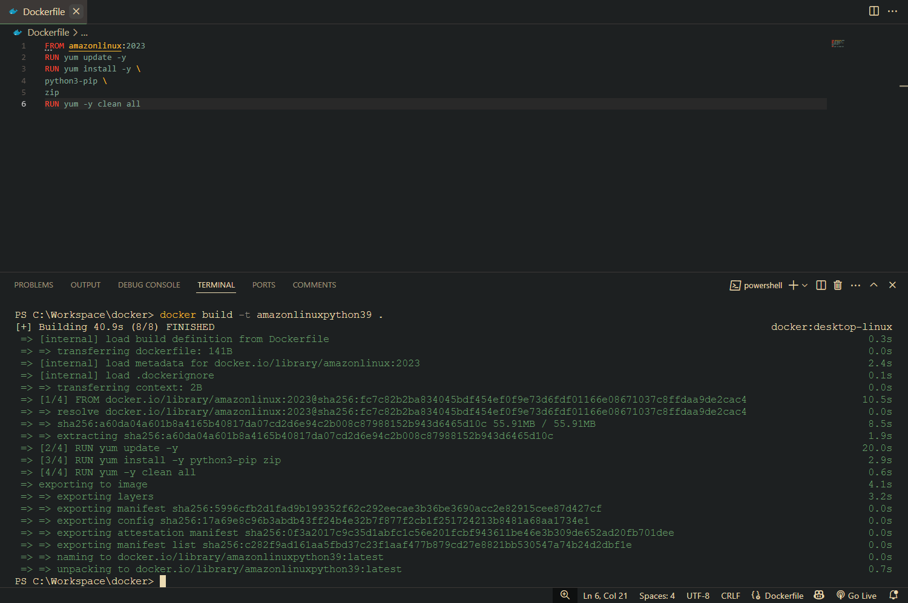

Instalei os modulos no container.

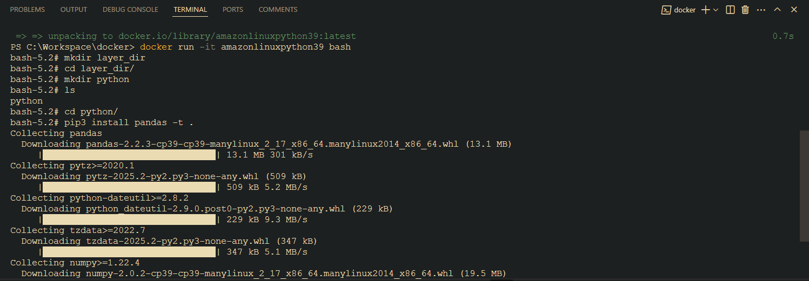

Zipei e fiz uma cópia dos arquivos dentro do docker.

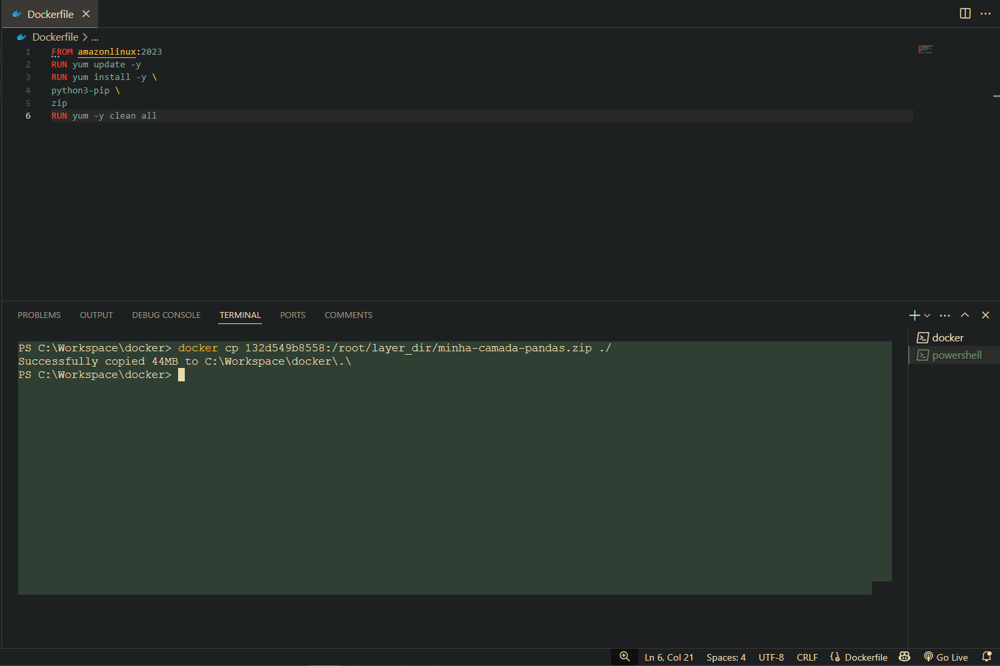

Por fim, fiz o upload dos arquivos no layer e executei o script python.

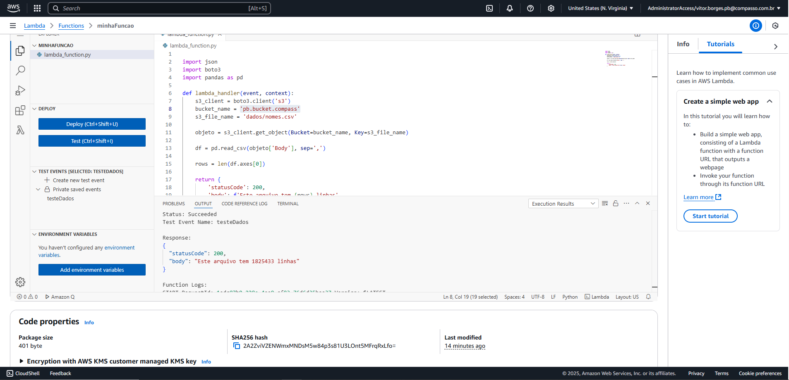

 

 

### S3 Bucket

Criei o bucket no s3 e fiz upload dos arquivos fornecidos.

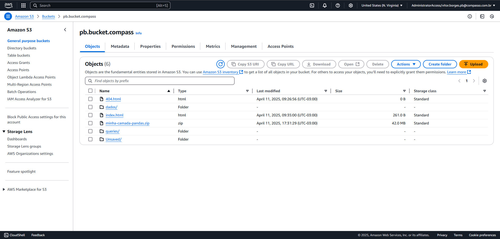

Habilitei o acesso publico, site estático e forneci as credenciais para a policy que me permitiria acessar o bucket via api.

Depois criei a pasta dados e fiz upload do csv.

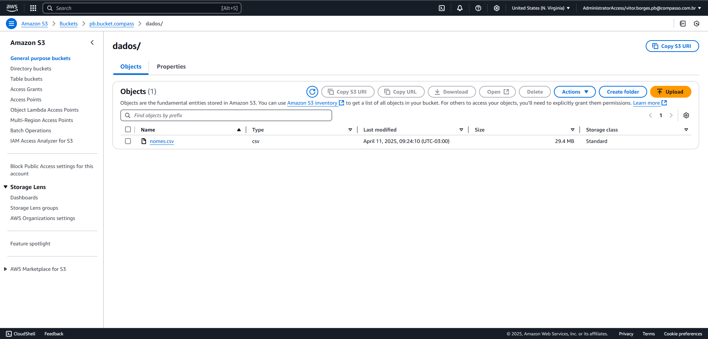

Por fim, testei o site e consegui fazer download atráves da api.

