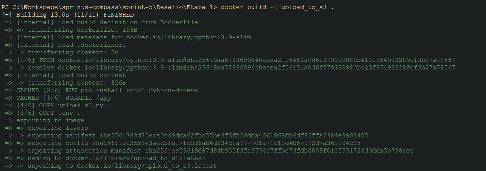
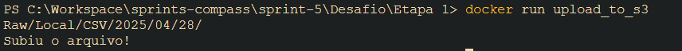
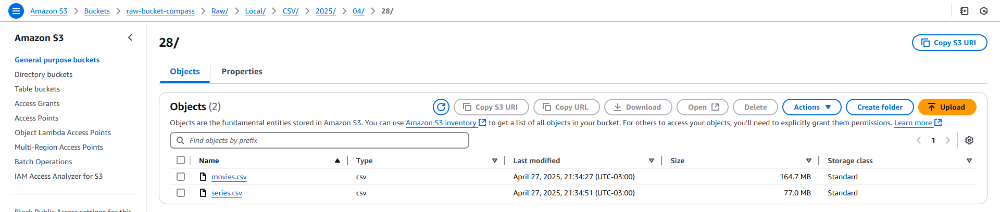
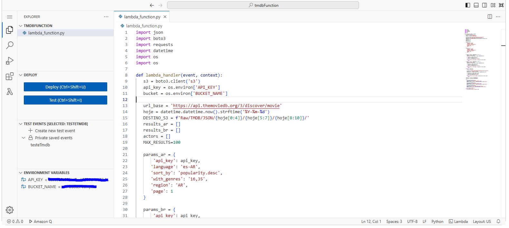
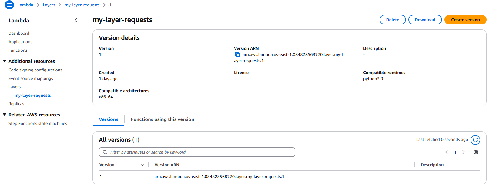
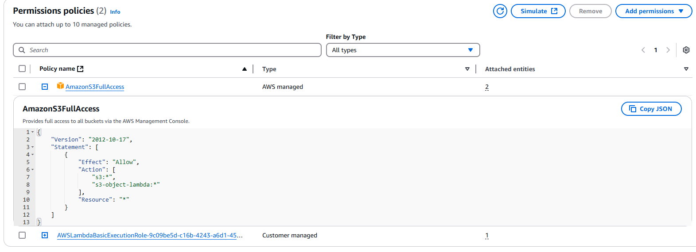
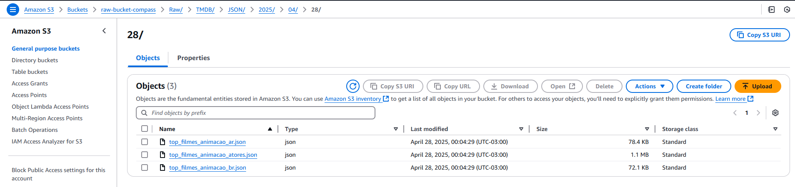

# Desafio
[Link para o vídeo](https://compasso-my.sharepoint.com/:v:/r/personal/vitor_borges_pb_compasso_com_br/Documents/vitor.borges-sprint05.mkv?csf=1&web=1&e=YUcZJ6&nav=eyJyZWZlcnJhbEluZm8iOnsicmVmZXJyYWxBcHAiOiJTdHJlYW1XZWJBcHAiLCJyZWZlcnJhbFZpZXciOiJTaGFyZURpYWxvZy1MaW5rIiwicmVmZXJyYWxBcHBQbGF0Zm9ybSI6IldlYiIsInJlZmVycmFsTW9kZSI6InZpZXcifX0%3D)
## Etapa 1: Fazendo Upload Local
Na primeira etapa, foi criado um container python que executa um script que faz upload de arquivos para um bucket na aws.

Primeiramente eu criei um script que faz upload de arquivos locais para o meu bucket no s3:
[link para o script](./Etapa-1/upload_s3.py)
```python
import boto3
from dotenv import load_dotenv
import datetime
import os

load_dotenv()

bucket = os.getenv('AWS_BUCKET_NAME')
hoje = datetime.datetime.now().strftime('%Y-%m-%d')

ARQUIVO_CSV_FILMES = '/app/assets/movies.csv'
ARQUIVO_CSV_SERIES = '/app/assets/series.csv'
DESTINO_S3 = f'Raw/Local/CSV/{hoje[0:4]}/{hoje[5:7]}/{hoje[8:10]}/'

print(DESTINO_S3)

s3 = boto3.client('s3')

try:
    s3.upload_file(ARQUIVO_CSV_FILMES, bucket, DESTINO_S3 + 'movies.csv')
    s3.upload_file(ARQUIVO_CSV_SERIES, bucket, DESTINO_S3 + 'series.csv')
    print("Subiu o arquivo!")
except Exception as e:
    print(f"Erro ao subir o arquivo: {e}")
```

Nesse código usamos a biblioteca **boto3** para fazer a comunicação com a aws, **python-dotenv** para carregar as variáveis de ambiente contendo minhas chaves de acesso.

A partir disso, eu peguei os arquivos que estão dentro do meu container e fiz o upload usando a função **upload_file**, que tem como parâmetro o arquivo, o nome do bucket e o seu nome e destino.

Repare que eu utilizei o modulo datetime para coletar a data atual e passar dinâmicamente como destino no meu bucket.

<br>
<hr>
<br>

Seguindo, eu criei um **dockerfile** contendo uma imagem **python slim** e instalando os modulos necessários para a execução do código.

```dockerfile
FROM python:3.9-slim
RUN pip install boto3 python-dotenv
WORKDIR /app
COPY upload_s3.py .
COPY .env .
COPY /assets assets/
CMD ["python", "upload_s3.py"]
```




Esse dockerfile copia o script, variáveis de ambiente e arquivos csv para dentro do container. Lá ele será executado e fará o upload para o meu bucket.




## Etapa 2
Já com os dados locais no bucket, agora é o momento de fazermos requisições via api TMDB para coletar os dados necessários para as minhas análises.

### Lambda
Inicio criando uma lambda function que irá fazer as chamadas da api e, posterirormente, salvar no mesmo bucket dos arquivos locais, só que agora em um diretório diferente.

O código é similiar ao da etapa anterior, com a diferença que usaremos o método **put_object** para salvarmos os dados no s3.



Aqui você pode ver o código inteiro:
<details>
    <summary>Código</summary>
    <pre>
        <code>
import json
import boto3
import requests
import datetime
import os
import os

def lambda_handler(event, context):
   s3 = boto3.client('s3')
   api_key = os.environ['API_KEY']
   bucket = os.environ['BUCKET_NAME']

   url_base = 'https://api.themoviedb.org/3/discover/movie'
   hoje = datetime.datetime.now().strftime('%Y-%m-%d')
   DESTINO_S3 = f'Raw/TMDB/JSON/{hoje[0:4]}/{hoje[5:7]}/{hoje[8:10]}/'
   results_ar = []
   results_br = []
   actors = []
   MAX_RESULTS=100
   
   params_ar = {
       'api_key': api_key,
      'language': 'es-AR',  
      'sort_by': 'popularity.desc', 
      'with_genres': '16,35', 
      'region': 'AR',
      'page': 1
   }

   params_br = {
       'api_key': api_key,
      'language': 'pt-BR',  
      'sort_by': 'popularity.desc', 
      'with_genres': '16,35', 
      'region': 'BR',
      'page': 1
   }


   for page in range(1, (MAX_RESULTS // 20) + 1):
      params_ar['page'] = page
      response_ar = requests.get(url_base, params=params_ar)

      if response_ar.status_code == 200:
         data_ar = response_ar.json()
         results_ar.extend(data_ar['results'])
      else:
         print(f"Error in AR request: {response_ar.status_code}")
         break

   for page in range(1, (MAX_RESULTS // 20) + 1):
      params_br['page'] = page
      response_br = requests.get(url_base, params=params_br)

      if response_br.status_code == 200:
         data_br = response_br.json()
         results_br.extend(data_br['results'])
      else:
         print(f"Error in BR request: {response_br.status_code}")
         break

   for film in results_br:
      film_id = film['id']

      url_actor = f'https://api.themoviedb.org/3/movie/{film_id}/credits'
      params_actor = {'api_key': api_key}
      response_actor = requests.get(url_actor, params=params_actor)

      if response_actor.status_code == 200:
         data_actor = response_actor.json()
         actors.extend(data_actor['cast'])
      else:
         print(f"Error in actor request: {response_actor.status_code}")
         break

   results_ar = results_ar[:MAX_RESULTS]
   results_br = results_br[:MAX_RESULTS]

   try:
      s3.put_object(Bucket=bucket, 
      Key=DESTINO_S3 + 'top_filmes_animacao_ar.json',
      Body=json.dumps(results_ar, ensure_ascii=False).encode('utf-8')
      )
      s3.put_object(Bucket=bucket, 
      Key=DESTINO_S3 + 'top_filmes_animacao_br.json',
      Body=json.dumps(results_br, ensure_ascii=False).encode('utf-8')
      )
      s3.put_object(Bucket=bucket,
      Key=DESTINO_S3 + 'top_filmes_animacao_atores.json',
      Body=json.dumps(actors, ensure_ascii=False).encode('utf-8')
      )
      print("Subiu o arquivo!")
   except Exception as e:
      print(f"Erro ao subir o arquivo: {e}")
        </code>
    </pre>
</details>
<br>
A requisição via api é muito simples, basta passar o endereço da api e ir adicionando os paramêtros para refinar a pesquisa.

Mas antes, eu precisei criar uma layer contendo o módulo **requests** para fazer requisições api RESTful ao TMDB.

Utilizando como apoio a sprint 4, eu criei o mesmo container **amazon linux** da atividade de lambda para instalar e exportar o arquivo contendo o modulo como zip.

Após isso, eu subi o arquivo zip para o meu layer recém criado.



Depois de todo esse processo, ainda faltava uma coisa para minha função lambda funcionar. 

Adicionar permissões **IAM** para minha função se comunicar com o s3.



Finalmente tenho tudo para fazer a função lambda funcionar!

Ao executar, o script puxa os dados que fazem sentido para minhas análises (comparação de popularidade entre dois paises e frequência de escala de autores) e guarda como json no meu bucket.



E com isso é iniciado o meu datalake que será usado até o final do curso.