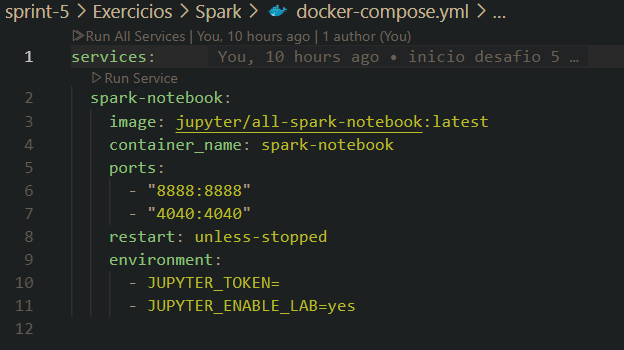
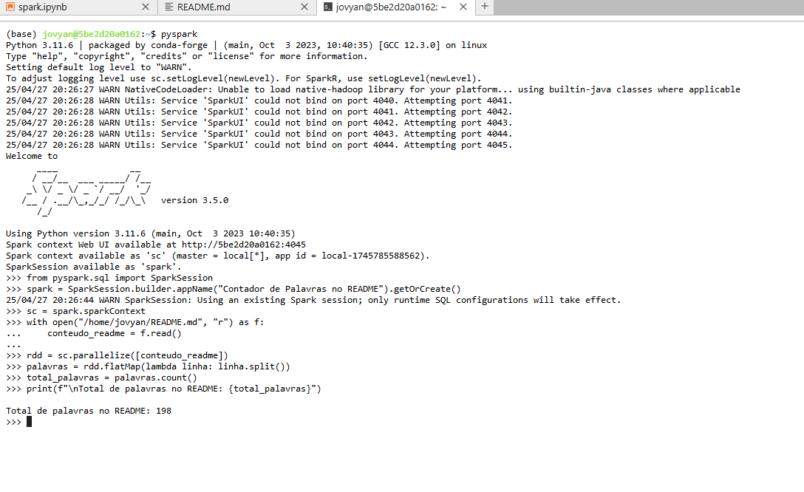
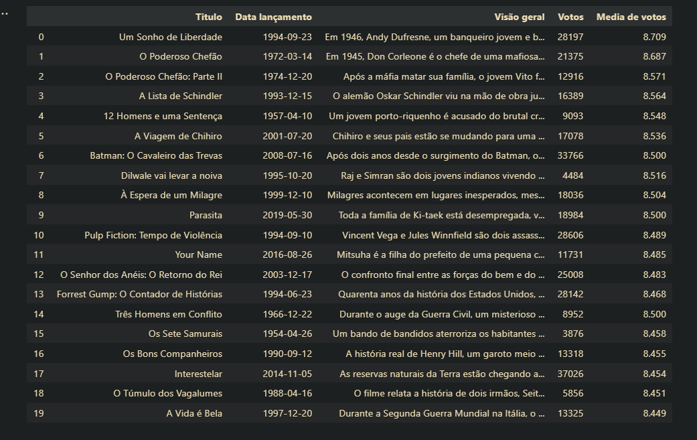

# Sprint 5
## Resumo
**AWS Fudamental of Analytics:** aqui se é ensinado os conceitos básicos de análise de dados usando os serviços da AWS. A gente aprende sobre coleta, armazenamento, processamento e visualização de dados, usando ferramentas como Amazon S3, Glue, Redshift, QuickSight, entre outros. 

A ideia principal é que a nuvem não é só mais prática, mas também pode ser mais barata e eficiente.

**AWS Introduction to Amazon Athena:**  é um curso que ensina como usar o Amazon Athena para consultar dados diretamente no Amazon S3 usando SQL. A gente aprende o básico de como configurar, criar bancos de dados e tabelas, e fazer consultas sem precisar montar um servidor.

**AWS Serveless Analytics:** é um curso que mostra como analisar dados na AWS sem precisar gerenciar servidores. Ele explica como usar serviços como Amazon Athena, AWS Glue, Amazon Redshift Serverless e Amazon QuickSight para fazer consultas, transformar dados e criar visualizações. A ideia principal é entender como construir pipelines de dados e fazer análises de forma escalável e com menos preocupação com infraestrutura.

## Desafio
[Link para o desafio](./Desafio/README.md)

## Exercicios

### Spark
Para realiza esse exercício eu usei um container docker contendo uma imagem com spark e jupyter notebook instalados.

Após subir o container e acessar o meu [notebook](./Exercicios/Spark/spark.ipynb), eu criei um script para contar as palavras do meu **README.md** principal.

### TMD
Nesse exercício eu utilizei uma requisição RESTful para coletar dados da api TMDB e organizar em um dataframe.

[Link para o notebook](./Exercicios/TMDB/tmdb.ipynb)

