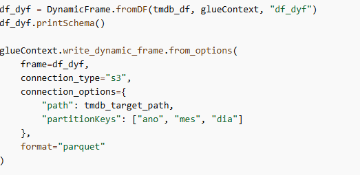

# Desafio
[Link para o video](https://compasso-my.sharepoint.com/:v:/g/personal/vitor_borges_pb_compasso_com_br/EXY4JMqpsH9OvlGmuQDWTgoBB2VqTt5LFjmkQnCp8w_lHw?nav=eyJyZWZlcnJhbEluZm8iOnsicmVmZXJyYWxBcHAiOiJTdHJlYW1XZWJBcHAiLCJyZWZlcnJhbFZpZXciOiJTaGFyZURpYWxvZy1MaW5rIiwicmVmZXJyYWxBcHBQbGF0Zm9ybSI6IldlYiIsInJlZmVycmFsTW9kZSI6InZpZXcifX0%3D&e=Aub7Dg)
# Etapa 1
[Link para o script](../Desafio/Etapa1/glue_csv.py)

Na primeira etapa, tratamos os dados em formato csv na camada raw do s3 bucket, aonde está localizado nosso datalake.

Para a role que dará permissão de acesso ao glue e demais componentes, reutilizarei o **AWSGlueServiceRole-Lab4** do exercício.

Iniciamos criando um job no AWS Glue, onde executaremos as instruções necessárias para a transformação dos dados para o formato parquet.

Importamos nosso conjunto de csv e transformamos em um dataframe spark glue.

Retiramos espaços em branco do nome das colunas, eliminamos os dados duplicados e adicionamos 3 novas colunas que serão fundamentais para o particionamento dos nossos dados.

Os dados serão particionados por ano, mês e dia.

Após isso, exibimos o schema para garantir a integridade dos dados.

E, por fim, transformamos nosso data frame para um tabela dinâmica do próprio glue.

Executado o script, nosso s3 ficará assim:

## Etapa 2
[Link para o script](../Desafio/Etapa2/glue_json.py)

Nessa etapa, importaremos os arquivos json que foram extraidos via api tmdb na sprint passada.

Todos os arquivos estão armazenados na camada raw, e separados por data de requisição.

Usamos o spark para criar um datafame json bruto.

Após isso, tratamos os dados para incluir ano, mês e dia. Isso nos auxiliara no momento do particionamento dos dados.

Transformamos nosso dataframe em um tabela dinâmica e posteriormente, criamos as partições na camada trusted.

No fim, a nossa camada trusted ficou desse jeito:

Seguindo as normas propostas pelo desafio!

