# Sprint 6
## Resumo
**AWS Glue Getting Started:** O AWS Glue Getting Started ensina o básico pra começar a usar o Glue, que é uma ferramenta da AWS pra organizar e transformar dados. No guia, a gente aprende como usar um crawler pra encontrar dados e criar uma tabela automática, e depois como montar um job pra transformar esses dados. É tipo um passo a passo pra entender como automatizar o processo de ETL na nuvem.

**Fundamentals of Analytics on AWS – Part 2:** Esse conteúdo mostra como montar uma solução de análise de dados na AWS, usando serviços integrados pra transformar dados brutos em insights, de forma escalável e econômica. É a continuação da parte 1, focando mais no processamento e na visualização dos dados.

## Desafio
[Link para o desafio](./Desafio/README.md)

## Exercicios

### Spark
[Link para o notebook](./Exercicios/PySpark/exercicio.ipynb)

Executei o exercicio no container da sprint passada. 

Gerei os nomes e fiz o processamento com o pyspark. Fiquei espantado com a velocidade de processamento.

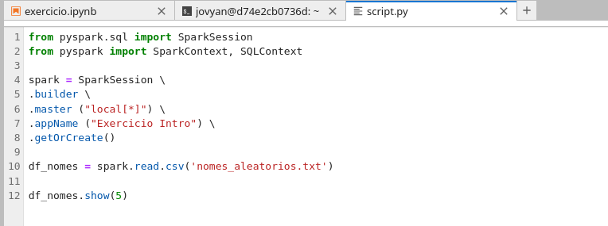
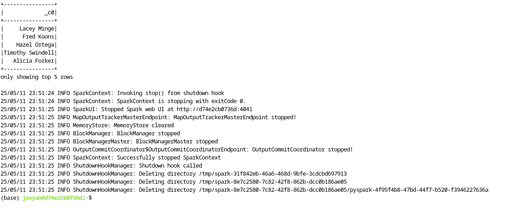
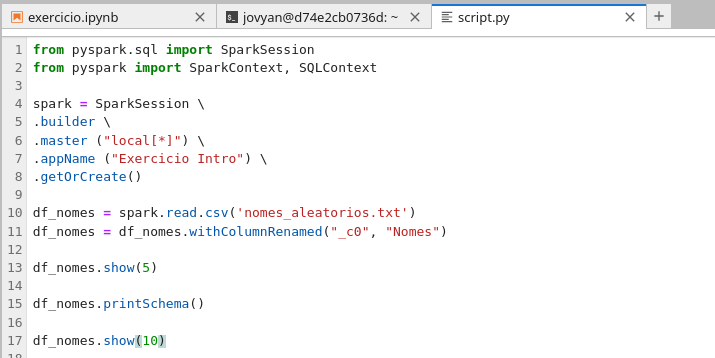
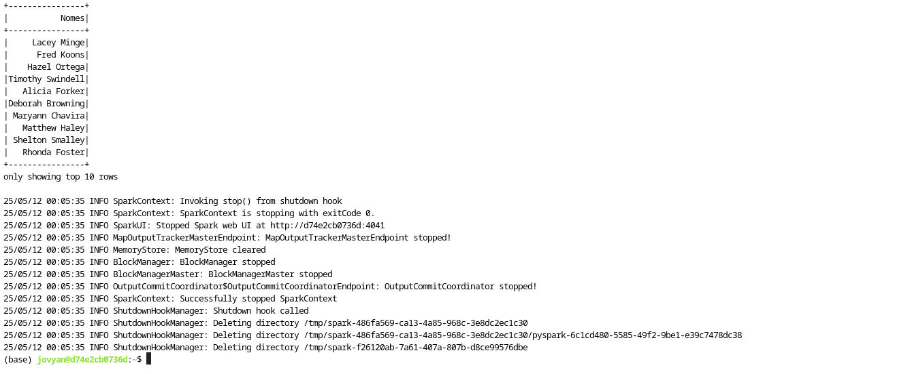
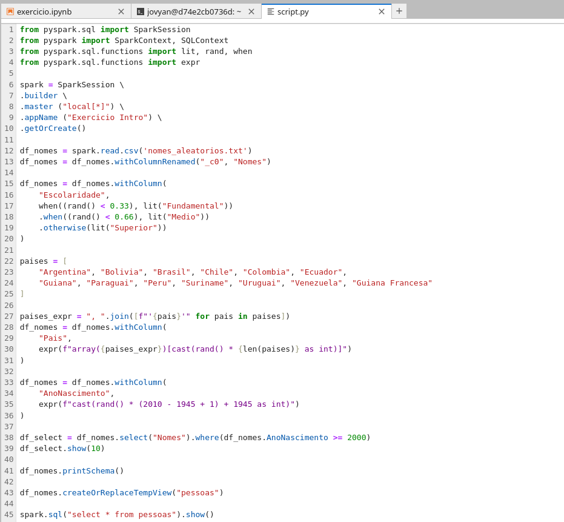
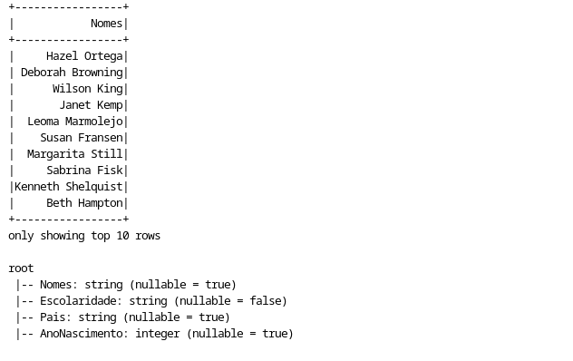
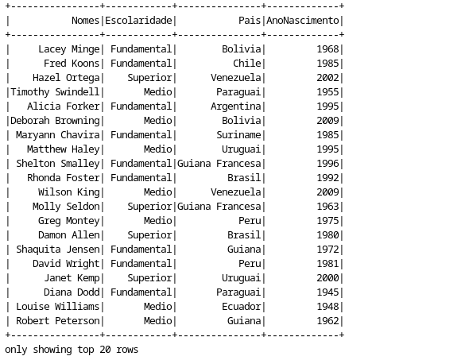

### Glue
[Link para o script](./Exercicios/Glue/script.py)

Nesse exercício eu criei o meu primeiro job no glue.

A ferramenta que implementa o spark se mostrou de grande importância para os processos de ETL.

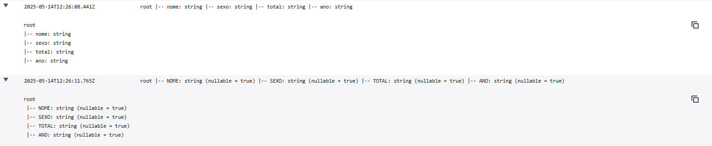
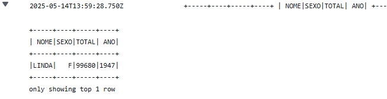
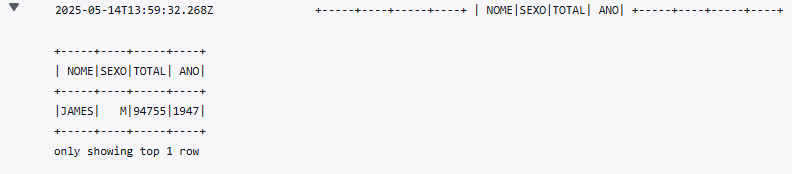
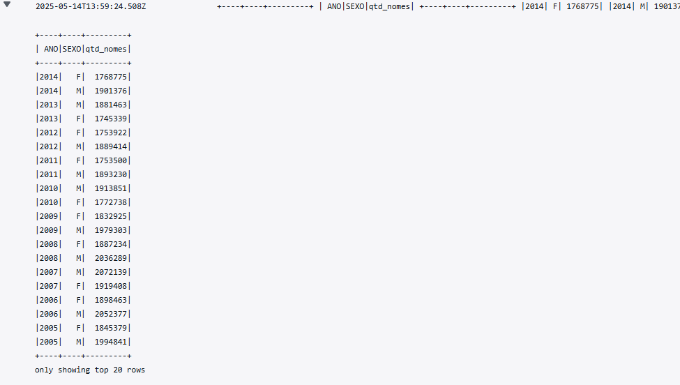
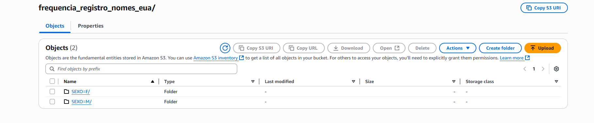
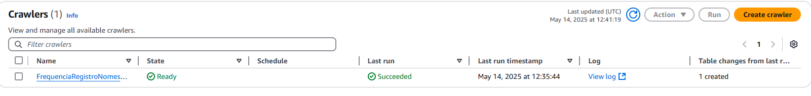

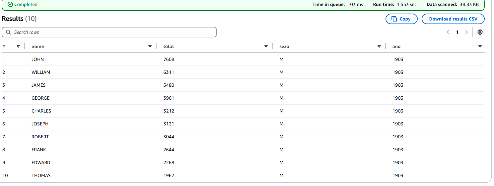