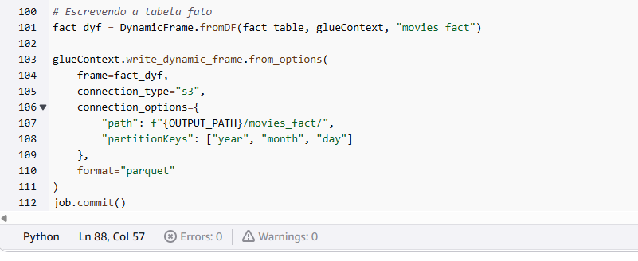

# Desafio
[Link para o video](https://compasso-my.sharepoint.com/:v:/r/personal/vitor_borges_pb_compasso_com_br/Documents/vitor.borges-sprint7.mkv?csf=1&web=1&e=Za3U1f)
# Etapa 1
Chegamos na camada **refined**, onde ocorrerá a construção das tabelas fato e dimensão que serão utilizadas para a próxima sprint, que será a finalização do projeto.

Iniciamos importando os modulos necessários para a criação das tabelas.

 
Com as bibliotecas importadas, podemos iniciar a modelagem de dados.

Vamos inicializar nossos dataframes da camada trusted no spark, lendo-os no formato parquet.

Os dados inicializados serão usados para criar as tabelas dimensões, que darão contexto a tabela fato.

As tabelas estão seguindo um esquema de **star schema** para modelagem de dados.

Ele consiste em uma tabela central (tabela de fatos) cercada por várias tabelas dimensionais. As tabelas dimensionais contêm informações descritivas sobre os eventos registrados na tabela de fatos. 

Usando vários **joins**, criamos nossa tabela fato, com chaves estrangeiras referênciando as suas respectivas tabelas dimensão.

Após todas os dataframes serem devidamente criados, nós usamos a função **write** para salvar os dados no diretório **refined**, previamente criado.

Com isso, executamos nosso job e esperamos o tempo de processamento terminar.

O código não apresentou erro no seu log, logo o conteúdo foi executado com sucesso.

Ao visitarmos nosso bucket, notamos que os diretórios contendo os arquivos em formato **parquet** foram criados.

## Etapa 2

Para o diagrama, eu usei a ferramenta [draw.io](adshttps://www.drawio.com/d). Organizei no formato **Star Schema** e ficou assim:

