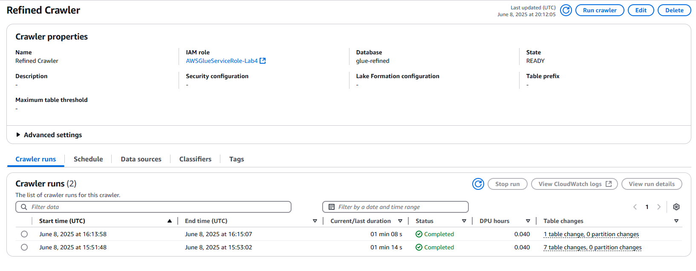
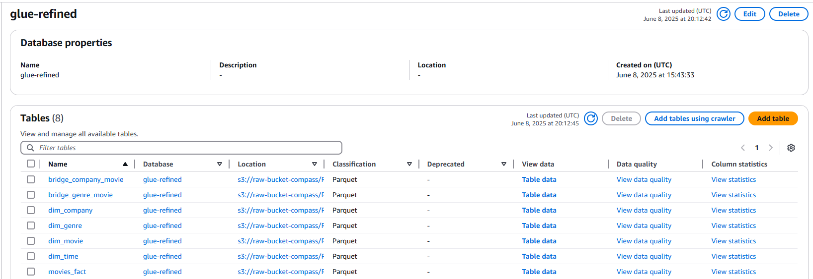
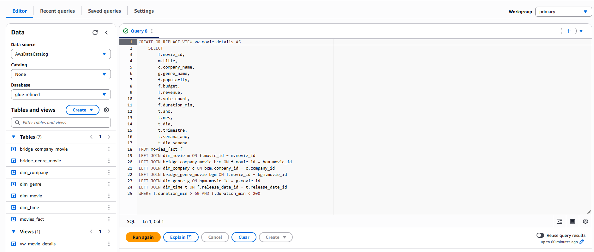
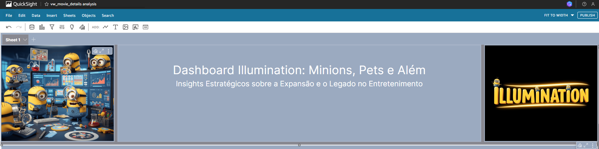
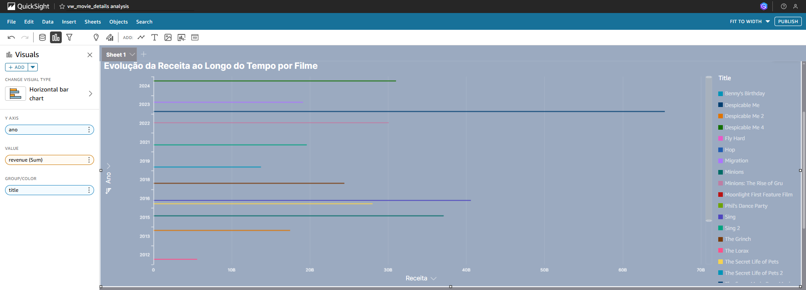
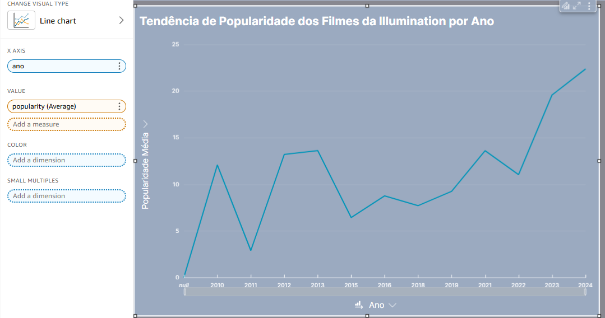
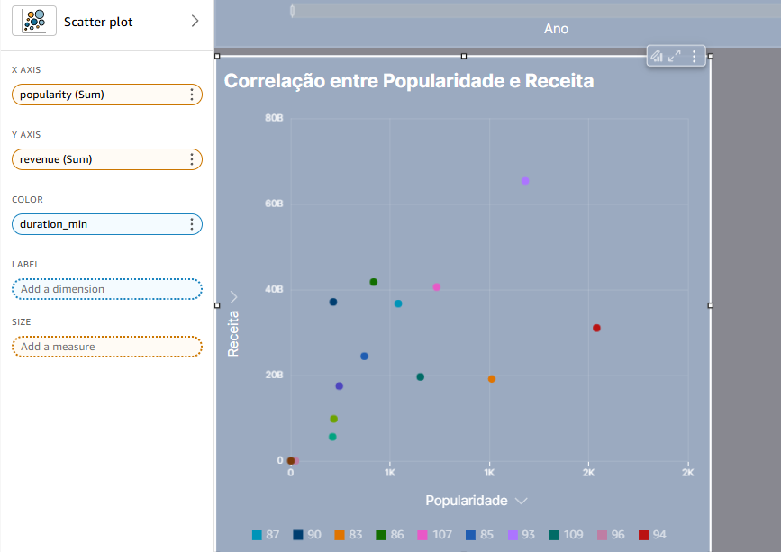
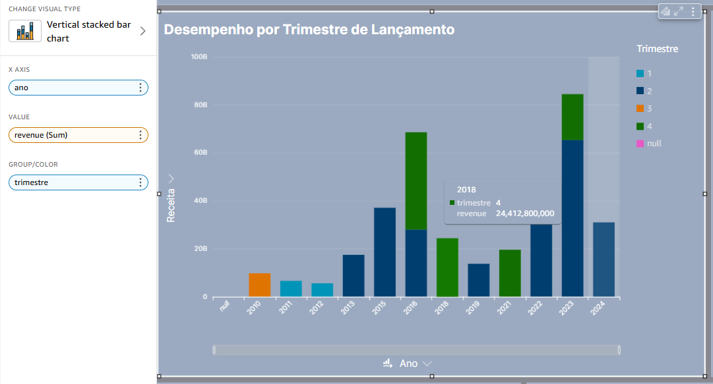
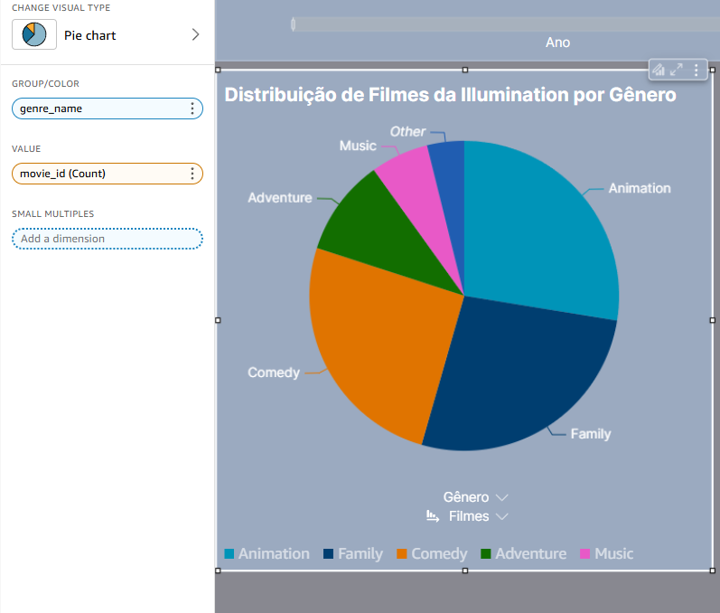
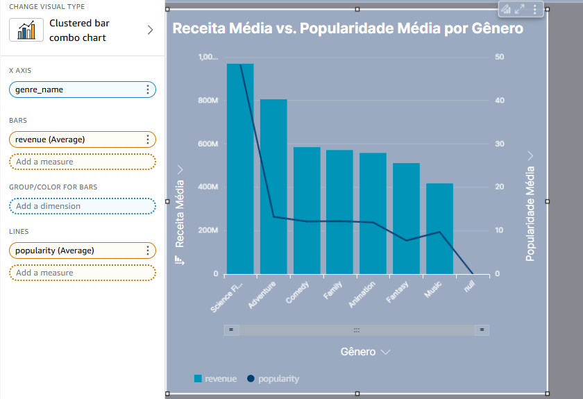

# Desafio

[Link para o vídeo]()

## Agradecimentos
Antes de mais nada, quero agradecer a todos do squad 1 que me auxiliaram nas minhas dúvidas e que, sempre de prontidão, me respodiam nos chats. A meus amigos: Ayalon e Filipe, que quase todos os dias estão comigo, compartilhando seus conhecimentos e frustações sobre o estágio, rindo e chorando juntos. 

E quero agradecer especialmente a minha *scrum master* Marli, que, mesmo sem saber, me incentivou a seguir firme durante esses meses, e a não desistir.

Agradeço também a todos os monitores que estiveram comigo nessa jornada.

A vocês, o meu mais sincero obrigado!

> A perseverança nas pequenas coisas, por Amor, é heroísmo
>
> -- <cite>São José Maria Escrivá</cite>

## Etapa 1
Na *sprint* anterior, realizamos a criação do nosso modelo dimensional, organizando nossos dados por tabelas fato e dimensões.

Agora, nessa *sprint*, utilizaremos esses dados já particionados para realizar a elaboração do nosso *dashboard*.

Vamos executar nosso *crawler* para fazer a varredura desses dados na nossa camada *refined*, contida no nosso *bucket* do s3.

## Etapa 2
Com a varredura realizada e os dados devidamente separados, iremos usar a ferramente *athena* para realizar nossas *queries* e manipulação de tabelas.

Para facilitar o uso dos dados, criei uma *view* aonde está concentrado todos as informações necessárias e pertinentes para a elaboração dos nossos gráficos na ferramenta *quick sight*.

Essa tabela posteriormente será consumida pelo *quick sight*, aonde irá interpretar os dados contidos nela. Tudo de forma automática através do *spice*.

## Etapa 3

No topo do dashboard, temos o título e a temática.

Para nosso primeiro gráfico, escolhi o clássico gráfico em barras horizontais.

Analisaremos a evolução da receita ao longo do tempo por filme.

No eixo y passamos o campo **ano** ordenado de forma decrescente, e no eixo x usamos o campo **receita**. Para dar contexto as barras, utlizamos o campo **nome**.

 

 

No segundo gráfico, utilizei o esquema de linhas, para evidenciar a tendência de popularidade dos filmes da Illumination por ano.

No eixo x eu usei o campo **ano** e no eixo y a **média da popularidade**.

As linhas marcam o nível de popularidade.

 

 

No terceiro gráfico, escolhi o modelo de dispersão para calcular a correlação entre popularidade e receita.

No eixo x usei a **soma  da popularidade** e no eixo y, usei a **soma da receita**. Após isso, usei também o campo **duration_min** para dar contexto aos dadatpoints.

 

 

No quarto gráfico, usei o modelo de barra vertical empilhada, onde consigo, por trimestre, mostrar o desempenho de lançamento.

No eixo x eu usei o campo **ano**, enquanto no eixo y usei a **soma da receita**. No agrupamento, foi categorizado pelo trimestre.

 

 

No quinto gráfico, optei por utilizar o tipo pizza para mostrar a distribuição de filmes por gênero.

Agrupei pelo nome do gênero e usei como valor a **contagem do movie_id**.

 

 

No sexto gráfico, usei um gráfico de barras e linhas para traçar a receita média vs. popularidade média por gênero.

No eixo x usei o campo **genre_name**, nas barras usei a **média a receita** e para a linha utilizei a **média da popularidade**.

 

 

No fim, meu dashboard ficou assim: [Minios Dashboard](../Desafio/Quick%20Sight/illumination-dashboard.pdf)
